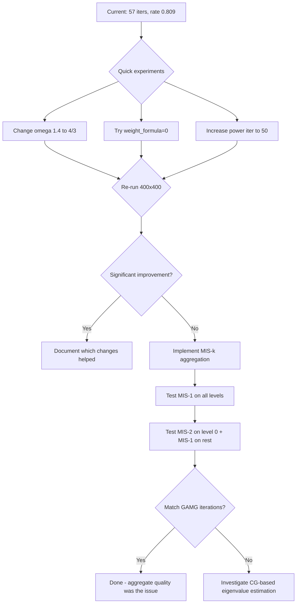

# Convergence Gap Analysis: PETSc GAMG vs AMGX SA (MULTI_PAIRWISE) on 400×400 Grid

## Problem Summary

On a 400×400 2D Poisson problem (160,000 DOFs), AMGX SA with MULTI_PAIRWISE aggregation takes **57 iterations** (convergence rate 0.809) compared to PETSc GAMG's **16 iterations** (rate ~0.49). This is a 3.6× iteration gap. The gap worsened from the 200×200 case (23 vs 14 iters, 1.6× gap), indicating the AMGX convergence rate **degrades with problem size** while GAMG's stays flat.

## Results Comparison (400×400)

| | PETSc GAMG | AMGX SA MULTI_PAIRWISE |
|---|-----------|------------------------|
| Levels | 5 | 5 |
| Iterations | 16 | 57 |
| Conv. rate | ~0.49 | 0.809 |
| Grid complexity | 1.167 | 1.146 |
| Operator complexity | 1.428 | 1.380 |
| Coarsest grid | 27 | 39 |

Key observation: grid and operator complexities are **very similar**, so the problem is not in the cost structure — it is in the **quality of the multigrid components**.

---

## Root Cause Analysis

### Cause 1: Aggregate Quality — MULTI_PAIRWISE vs MIS-k (PRIMARY SUSPECT)

**This is the most likely dominant cause of the convergence degradation.**

PETSc GAMG uses **MIS-k aggregation** (Maximal Independent Set with distance k):
- MIS-1 for standard levels, MIS-2 for aggressive coarsening levels
- Produces roughly spherical aggregates with controlled diameter
- Aggregate diameter is bounded by 2k+1
- Guarantees no two aggregate roots are within distance k of each other

AMGX MULTI_PAIRWISE uses **heavy-edge pairwise matching** with multiple passes:
- Each pass merges pairs of nodes based on edge weight
- 3 passes → ~8× coarsening ratio (matching GAMG's ratio)
- But aggregates are formed by **chaining pairs**, producing elongated, non-spherical shapes
- Aggregate quality degrades with problem size because chains get longer relative to the domain

**Why this matters for SA**: The tentative prolongator P_tent maps each aggregate to a coarse DOF. If aggregates are elongated/irregular, the constant near-null space vector is a poor approximation within the aggregate, and the smoothed prolongator cannot fully compensate. This directly degrades the approximation property of the coarse grid correction.

**Evidence**: The SIZE_4 selector (which produces fixed-size 4-node aggregates with better shape control) gives **23 iterations** at 400×400 — much closer to GAMG's 16 — but at the cost of 2.68× operator complexity (vs 1.38×). This confirms aggregate quality is the key differentiator.

### Cause 2: SA Damping Factor ω — Minor Difference

AMGX uses `ω = 1.4 / ρ(D⁻¹A)` while PETSc uses `ω = 4/(3·ρ(D⁻¹A)) ≈ 1.333/ρ(D⁻¹A)`.

- AMGX: ω = 1.4/1.846 ≈ 0.758
- PETSc would give: ω = 1.333/1.974 ≈ 0.675

The AMGX value is ~12% larger. A larger ω means more aggressive smoothing of P_tent, which can be beneficial but also risks over-smoothing. The classical SA theory (Vaněk et al.) uses `4/(3·ρ)`. This is a **minor contributor** — unlikely to explain a 3.6× iteration gap by itself, but worth matching.

### Cause 3: Eigenvalue Estimation — Power Iteration vs CG

- AMGX: power iteration (20 iterations) → ρ = 1.846 on finest level
- PETSc: CG-based estimate → ρ = 1.974 on finest level

The AMGX estimate is ~6.5% lower. Since `λ_max = 1.1 × ρ`, this means the Chebyshev smoother's upper bound is slightly lower in AMGX (2.030 vs 2.172). If the true spectral radius is closer to PETSc's estimate, the AMGX Chebyshev smoother may not be covering the full spectrum, leaving some high-frequency error components unsmoothed.

This is a **moderate contributor** — the Chebyshev polynomial is less effective when the eigenvalue interval is wrong.

### Cause 4: Convergence Rate Scaling — h-dependent vs h-independent

The most alarming observation is that AMGX's convergence rate **degrades with h**:
- 200×200: rate = 0.59
- 400×400: rate = 0.809

While GAMG stays nearly flat:
- 200×200: rate ≈ 0.47
- 400×400: rate ≈ 0.49

An h-dependent convergence rate in SA-AMG typically indicates a **failure of the approximation property** — the coarse grid cannot adequately represent smooth error. This points back to aggregate quality (Cause 1) as the root issue, since poor aggregates produce a P_tent that does not span the near-null space well enough on finer grids.

### Cause 5: Coarse Level Eigenvalue Estimates

Comparing coarse-level ρ values:

| Level | GAMG ρ | AMGX ρ |
|-------|--------|--------|
| Finest | 1.974 | 1.846 |
| Level 1 | 1.446 | 1.506 |
| Level 2 | 1.642 | 1.486 |
| Level 3 | 1.552 | 1.731 |

The coarse-level estimates diverge, particularly at level 3 where AMGX has ρ=1.731 vs GAMG's 1.552. This suggests the coarse operators have different spectral properties, which is a consequence of different aggregate shapes producing different Galerkin operators.

---

## Proposed Solutions (Ranked by Expected Impact)

### Solution 1: Implement MIS-based Aggregation (HIGH IMPACT)

Implement a MIS-k aggregation selector in AMGX to match PETSc GAMG's approach. This is the single most impactful change.

**Implementation approach**:
1. Create `src/aggregation/selectors/mis_selector.cu`
2. Implement greedy MIS algorithm on GPU:
   - Assign random priorities to each node
   - In parallel: a node becomes a root if it has the highest priority among all unaggregated neighbors within distance k
   - Assign non-root nodes to the nearest root's aggregate
3. Register as `"MIS"` or `"MIS_K"` selector
4. Support `aggregation_mis_k` config parameter (default 1, use 2 for aggressive)

**Key design decisions**:
- Use distance-1 MIS for standard levels, distance-2 for aggressive coarsening
- Aggregate diameter control: limit aggregate size to ~(2k+1)^d nodes in d dimensions
- Handle singletons by merging with strongest neighbor

### Solution 2: Match SA Damping Factor to PETSc (LOW-MEDIUM IMPACT, EASY)

Change `ω = 1.4/ρ` to `ω = 4/(3·ρ) ≈ 1.333/ρ` in `estimateSADampingFactor()`.

**Files to modify**: [`aggregation_amg_level.cu`](src/aggregation/aggregation_amg_level.cu:3177)
- Line 3177: Change `1.4` to `4.0/3.0`
- Line 3086: Update comment
- Line 3451: Update comment

This is a one-line fix that brings the SA smoothing exactly in line with the classical Vaněk theory and PETSc's implementation.

### Solution 3: Improve Eigenvalue Estimation (MEDIUM IMPACT)

Replace or augment the power iteration with a CG-based eigenvalue estimate (Lanczos/CG approach), matching PETSc's method.

**Approach**:
- Run a few (10-20) CG iterations on D⁻¹A with a random starting vector
- Extract eigenvalue estimates from the CG tridiagonal matrix
- This gives both upper and lower bounds on the spectrum

**Alternative quick fix**: Increase power iteration count from 20 to 50, or use a Chebyshev-accelerated power iteration for faster convergence to the dominant eigenvalue.

### Solution 4: Aggregate Shape Improvement for MULTI_PAIRWISE (MEDIUM IMPACT)

If implementing full MIS is too complex initially, improve MULTI_PAIRWISE aggregate quality:

1. **Increase aggregation_passes**: Try 4 or 5 passes instead of 3 to get larger aggregates with potentially better shapes
2. **Add aggregate shape metrics**: Compute and log aggregate diameter/volume ratio to diagnose shape quality
3. **Post-processing**: After pairwise matching, run a cleanup pass that splits elongated aggregates and merges small ones
4. **Use `weight_formula=0`** instead of `weight_formula=1` — the default formula may produce better aggregate shapes for structured grids

### Solution 5: Use Outer Krylov Accelerator (WORKAROUND, HIGH IMPACT ON ITERATION COUNT)

Instead of using Richardson iteration (which is what the current V-cycle solver does), wrap the AMG V-cycle as a preconditioner for CG or FGMRES. This can dramatically reduce iteration counts even with a suboptimal preconditioner.

**Config change**: Use `"solver": "PCG"` or `"solver": "FGMRES"` as the outer solver with `"preconditioner": { AMG config }`.

This doesn't fix the underlying AMG quality issue but is a practical workaround.

---

## Recommended Investigation Order

## Immediate Action Items

1. **Quick win — fix omega**: Change `1.4` → `4.0/3.0` in [`estimateSADampingFactor()`](src/aggregation/aggregation_amg_level.cu:3177)
2. **Quick experiment — weight_formula**: Change `weight_formula` from 1 to 0 in [`AGGREGATION_SA_CHEBY.json`](src/configs/AGGREGATION_SA_CHEBY.json:25)
3. **Quick experiment — more power iterations**: Change default `max_iter` from 20 to 50 in [`estimateSADampingFactor()`](src/aggregation/aggregation_amg_level.cu:3094)
4. **Medium-term — MIS aggregation**: Implement MIS-k selector as a new aggregation selector
5. **Diagnostic — aggregate quality**: Add logging of aggregate diameter and aspect ratio to diagnose shape issues
