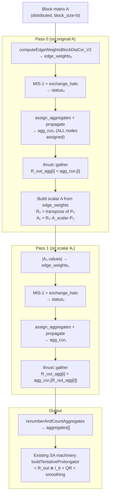
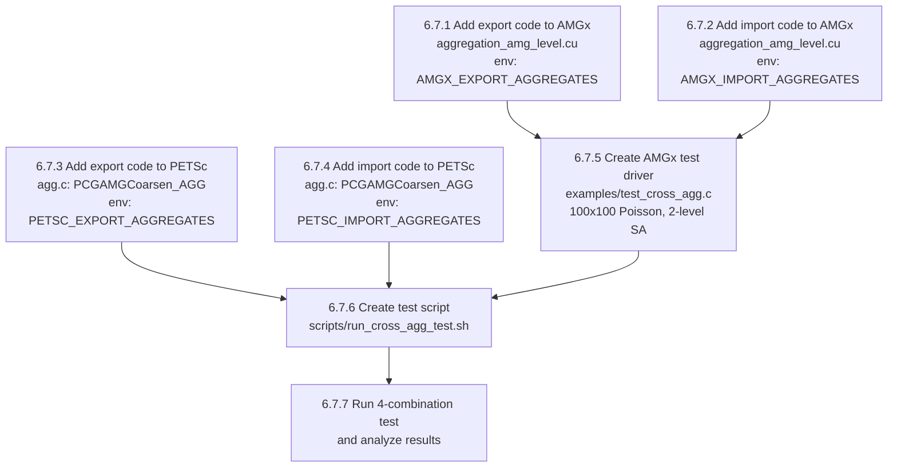

# MIS-k MPI-Parallel Implementation Plan

## Overview

Implement MPI-parallel MIS-k aggregation using PETSc's Galerkin coarsening approach:
```
R_out = I
for i = 0 to k-1:
    R = MIS-1(A)       // with exchange_halo for MPI correctness
    A = R * A * R^T     // Galerkin coarse-grid operator
    R_out = R * R_out   // compose restrictions (thrust::gather on integer array)
```

All work on the scalar nodal graph. Final output is `aggregates[]` (integer array).
The existing SA machinery in `buildTentativeProlongator()` handles the Kronecker
expansion `P_tent = R_out ⊗ I_b` + QR + smoothing — no changes needed there.

---

## Step 1: MIS-1 MPI Fix — Add `exchange_halo` to MIS-1 Loop

### Goal
Make `mis_k=1` fully MPI-correct by exchanging the `status_vec` (IVector) after
each MIS iteration. Currently, boundary nodes on different partitions can both
become MIS roots because halo nodes are skipped (`jcol >= num_rows`).

### Files to Modify
- `src/aggregation/selectors/mis_selector.cu` — ~10 lines in `setAggregates_common_sqblocks()`

### Changes

In the MIS iteration loop (lines 514-540 of `mis_selector.cu`), after each kernel
launch and before counting undecided nodes, add:

```cpp
// After find_mis_k1_kernel or find_mis_k2_kernel:
if (!A.is_matrix_singleGPU())
{
    // Resize status_vec to cover halo nodes if needed
    if (status_vec.size() < total_rows)
    {
        status_vec.resize(total_rows, MIS_UNDECIDED);
        status_ptr = status_vec.raw();
    }
    status_vec.dirtybit = 1;
    A.manager->exchange_halo(status_vec, status_vec.tag);
}
```

Also need to resize `node_weights` to `total_rows` and exchange it once before
the loop so that halo node weights are available for comparison:

```cpp
if (!A.is_matrix_singleGPU())
{
    node_weights.resize(total_rows);
    // Recompute weights for halo nodes (or exchange them)
    assign_node_weights_kernel<<<...>>>(total_rows, node_weights_ptr);
    // Actually, hash(node_id) is deterministic, so each rank computes the
    // same weight for the same global node. But local node IDs differ across
    // ranks, so we must exchange. Alternatively, use global IDs for hashing.
    // Simplest: exchange node_weights after computing for owned nodes.
    node_weights.dirtybit = 1;
    A.manager->exchange_halo(node_weights, node_weights.tag);
}
```

**Important**: The `find_mis_k1_kernel` currently uses `jcol >= num_rows` to skip
halo nodes. After exchanging status, halo nodes will have valid status values.
Change the skip condition to only skip self-loops (`jcol == tid`), and use
`total_rows` as the upper bound for valid columns. The kernel should NOT modify
halo nodes (only read their status), so keep the `tid < num_rows` (owned) guard
for writes.

### Verification (Single GPU)
- Build and run with `selector=MIS, mis_k=1` on a single GPU
- Compare aggregate count and convergence with the pre-fix version
- Single-GPU behavior should be identical (no halo exchange occurs)
- Run the existing aggregation tests: `aggregates_determinism_test`, `multi_pairwise_test`

### Verification Commands
```bash
# Build
cd build && cmake .. && make -j$(nproc)

# Run single-GPU test with MIS selector
./tests/amgx_tests_launcher --gtest_filter="*aggregates*"

# Run a Poisson solve with MIS
./examples/amgx_capi -m ../test_matrices/poisson7_100.mtx \
    -c ../src/configs/AGGREGATION_SA_MIS.json
```

---

## Step 2: Single-GPU MIS-k=2 via Galerkin Coarsening Loop

### Goal
Implement the full Galerkin coarsening loop for `mis_k=2` on single GPU.
Multi-GPU with `mis_k>1` falls back to `mis_k=1` with a warning.

### Files to Modify
- `src/aggregation/selectors/mis_selector.cu` — restructure `setAggregates_common_sqblocks()`
- `include/aggregation/selectors/mis_selector.h` — add helper method declarations

### Algorithm

Restructure `setAggregates_common_sqblocks()` to:

```cpp
void setAggregates_common_sqblocks(A, aggregates, aggregates_global, num_aggregates)
{
    int n_orig = A.get_num_rows();

    // Multi-GPU fallback for mis_k > 1 (until Step 4 is implemented)
    int effective_k = this->m_mis_k;
    if (!A.is_matrix_singleGPU() && effective_k > 1)
    {
        // TODO: Step 4 will add multi-GPU support for mis_k > 1
        // For now, fall back to mis_k=1 with a warning
        amgx_printf("WARNING: mis_k=%d not yet supported on multi-GPU, falling back to mis_k=1\n", effective_k);
        effective_k = 1;
    }

    // Initialize composed aggregation: R_out_agg[i] = i (identity)
    IVector R_out_agg(n_orig);
    thrust::sequence(R_out_agg.begin(), R_out_agg.end());

    // A_cur starts as the original matrix
    // For pass 0, we use A directly (block matrix)
    // For pass 1+, A_cur is the scalar Galerkin matrix
    const Matrix_d *A_cur_ptr = &A;
    Matrix_d A_coarse;  // storage for Galerkin coarse matrix

    for (int pass = 0; pass < effective_k; pass++)
    {
        const Matrix_d &A_cur = *A_cur_ptr;
        int n_cur = A_cur.get_num_rows();

        // --- Phase 1: Compute edge weights ---
        // Pass 0: use computeEdgeWeightsBlockDiaCsr_V2 on block matrix
        // Pass 1+: use |A_cur.values| directly (scalar matrix)
        FVector edge_weights_cur;
        if (pass == 0)
        {
            // existing edge weight computation (already in current code)
            edge_weights_cur.resize(A_cur.get_num_nz());
            computeEdgeWeightsBlockDiaCsr_V2<<<...>>>(...);
        }
        else
        {
            // Scalar matrix: edge weights = |values|
            edge_weights_cur.resize(A_cur.get_num_nz());
            thrust::transform(A_cur.values.begin(),
                              A_cur.values.begin() + A_cur.get_num_nz(),
                              edge_weights_cur.begin(),
                              [] __device__ (auto v) { return fabsf((float)v); });
        }

        // --- Phase 2: MIS-1 root selection ---
        // (existing code: assign_node_weights, find_mis_k1_kernel loop,
        //  with exchange_halo from Step 1)
        IVector status_cur(n_cur, MIS_UNDECIDED);
        FVector node_weights_cur(n_cur);
        assign_node_weights_kernel<<<...>>>(n_cur, node_weights_cur.raw());
        // ... MIS-1 iteration loop with exchange_halo ...

        // --- Phase 3: Assign ALL nodes to aggregates ---
        IVector agg_cur(n_cur, -1);
        assign_aggregates_kernel<<<...>>>(A_cur, edge_weights_cur, status_cur, agg_cur);
        // propagate to ensure no orphans
        propagate_aggregates_kernel<<<...>>>(agg_cur, ...);

        // --- Phase 4: Compose R_out_agg ---
        // Renumber agg_cur to 0..n_roots-1
        int n_roots;
        renumberAndCountAggregates(agg_cur, dummy_global, n_cur, n_roots);

        // R_out_agg[i] = agg_cur[R_out_agg[i]]
        IVector tmp(n_orig);
        thrust::gather(R_out_agg.begin(), R_out_agg.end(),
                       agg_cur.begin(), tmp.begin());
        R_out_agg.swap(tmp);

        // --- Phase 5: Galerkin product (skip on last pass) ---
        if (pass < effective_k - 1)
        {
            // Build R from agg_cur (pattern from agg_selector.cu:83-97)
            Matrix_d P_cur, R_cur;
            P_cur.addProps(CSR); P_cur.delProps(COO); P_cur.delProps(DIAG);
            P_cur.row_offsets.resize(n_cur + 1);
            P_cur.values.resize(n_cur, 1.0);
            P_cur.col_indices.resize(n_cur);
            thrust::sequence(P_cur.row_offsets.begin(), P_cur.row_offsets.end());
            thrust::copy(agg_cur.begin(), agg_cur.end(), P_cur.col_indices.begin());
            P_cur.resize(n_cur, n_roots, n_cur, 1, 1, false);
            P_cur.set_initialized(1);

            // R = P^T
            R_cur.set_initialized(0);
            transpose(P_cur, R_cur);

            // A_coarse = R * A_cur * P  (Galerkin product)
            A_coarse.set_initialized(0);
            CSR_Multiply<TConfig_d>::csr_galerkin_product(
                R_cur, A_cur, P_cur, A_coarse,
                nullptr, nullptr, nullptr, nullptr, nullptr, nullptr, nullptr);
            A_coarse.computeDiagonal();
            A_coarse.set_initialized(1);

            A_cur_ptr = &A_coarse;
        }
    }

    // --- Final: output aggregates ---
    aggregates.resize(total_rows);
    thrust::fill(aggregates.begin(), aggregates.end(), -1);
    thrust::copy(R_out_agg.begin(), R_out_agg.end(), aggregates.begin());

    this->renumberAndCountAggregates(aggregates, aggregates_global,
                                     n_orig, num_aggregates);
}
```

### Key Implementation Details

1. **Edge weights for pass 1+**: The Galerkin product `R·A·R^T` sums fine-grid
   values into coarse entries. Use `|A_coarse.values|` as edge weights for
   `assign_aggregates_kernel` on subsequent passes.

2. **Node weights**: Use `hash_val(node_id, seed + pass)` with a different seed
   per pass to avoid correlation between passes.

3. **`csr_galerkin_product` requires `block_size == 1`**: Pass 0 operates on the
   block matrix but only uses the graph topology + edge weights. The Galerkin
   product on pass 0 needs a scalar matrix. Solution: build a scalar `A_scalar`
   from the edge weights for the Galerkin product:
   ```cpp
   // A_scalar has same sparsity as A, values = edge_weights
   A_scalar.row_offsets = A.row_offsets
   A_scalar.col_indices = A.col_indices
   A_scalar.values = edge_weights
   A_scalar.resize(n, n, nnz, 1, 1)  // 1x1 blocks
   ```

4. **Multi-GPU fallback**: When `!A.is_matrix_singleGPU() && mis_k > 1`, print
   a warning and set `effective_k = 1`. Add a comment:
   ```cpp
   // TODO (Step 4): Multi-GPU MIS-k support
   // Use setNeighborAggregates() to set up Ac.manager from A.manager + agg_cur,
   // then computeAOperator() for the distributed Galerkin product,
   // then prepareNextLevelMatrix() to finalize halo rows.
   // These functions are in aggregation_amg_level.cu and handle all
   // distributed manager setup (B2L_maps, halo_offsets, renumbering).
   ```

### Verification (Single GPU)
```bash
# Compare MIS-1 vs MIS-2 aggregate counts
./examples/amgx_capi -m ../test_matrices/poisson7_100.mtx \
    -c ../src/configs/AGGREGATION_SA_MIS.json \
    -amgx "selector=MIS, mis_k=1"

./examples/amgx_capi -m ../test_matrices/poisson7_100.mtx \
    -c ../src/configs/AGGREGATION_SA_MIS.json \
    -amgx "selector=MIS, mis_k=2"

# Expected: MIS-2 produces ~4x fewer aggregates than MIS-1
# Expected: MIS-2 convergence rate should be similar or slightly worse
#           (fewer aggregates = more aggressive coarsening)
```

---

## Step 3: Verify MIS-1 MPI Fix on Multi-GPU

### Goal
Verify that Step 1's `exchange_halo` fix produces correct MIS-1 aggregation
on multiple GPUs. The aggregate boundaries should be consistent across partitions.

### Prerequisites
- Step 1 completed and verified on single GPU
- Multi-GPU test environment (2+ GPUs or MPI ranks)

### Verification
```bash
# 2-GPU test with MIS-1
mpirun -np 2 ./examples/amgx_capi \
    -m ../test_matrices/poisson7_100.mtx \
    -c ../src/configs/AGGREGATION_SA_MIS.json \
    -amgx "selector=MIS, mis_k=1"

# Compare convergence rate with single-GPU run
# Expected: similar iteration count and convergence rate
# Expected: no MIS roots adjacent across partition boundaries
```

### What to Check
1. **Convergence**: iteration count should be similar to single-GPU
2. **Aggregate quality**: no adjacent MIS roots at partition boundaries
3. **Determinism**: same result regardless of partition count (for same global ordering)
4. **No crashes**: `exchange_halo` on `IVector` status_vec works correctly

### Potential Issues
- `node_weights` must be consistent across partitions. Since `hash_val(local_id)`
  uses local IDs, different partitions assign different weights to the same global
  node. Fix: use global node IDs for hashing, or exchange node_weights.
- `status_vec` must be resized to `total_rows` (owned + halo) before exchange.

---

## Step 4: Multi-GPU MIS-k=2 via Distributed Galerkin Coarsening

### Goal
Remove the multi-GPU fallback from Step 2 and implement the full distributed
Galerkin coarsening loop for `mis_k > 1`.

### Approach: Reuse Existing Distributed Infrastructure

The existing aggregation AMG level already has a complete distributed "PtAP"
pipeline that runs for every AMG level:

```
setNeighborAggregates()     — sets up Ac.manager from A.manager + aggregates
computeRestrictionOperator() — builds R_row_offsets, R_column_indices
computeAOperator()          — Ac = R·A·R^T (CoarseAGenerator)
prepareNextLevelMatrix()    — exchanges halo rows, finalizes Ac
```

Key functions and their locations:
- `setNeighborAggregates()` — `aggregation_amg_level.cu:1751`
  Sets up `Ac.manager` with `B2L_maps`, `halo_offsets`, `neighbors`, `createRenumbering`
- `computeAOperator()` — `coarse_A_generator.h:29` (standalone virtual function)
  Interface: `computeAOperator(A, Ac, aggregates, R_row_offsets, R_col_indices, num_aggs)`
- `prepareNextLevelMatrix()` — `aggregation_amg_level.cu:1585`
  Exchanges halo rows, renumbers columns, appends halo data to Ac

### Implementation Options

**Option A (Recommended): Extract utility functions**

Refactor `setNeighborAggregates` and `prepareNextLevelMatrix` into standalone
utility functions that take `(A, Ac, aggregates, num_aggregates)` without
requiring an `Aggregation_AMG_Level` object. This is ~200 lines of refactoring
but produces clean, reusable code.

**Option B: Inline the logic**

Copy the ~80 lines of `setNeighborAggregates` logic (B2L_maps setup,
createRenumbering, halo aggregate exchange) directly into the MIS selector.
Faster to implement but duplicates code.

**Option C: Create temporary AMG level**

Create a temporary `Aggregation_AMG_Level` object, set its member variables,
and call its methods. Awkward but avoids code duplication.

### Files to Modify
- `src/aggregation/selectors/mis_selector.cu` — remove multi-GPU fallback, add distributed loop
- `src/aggregation/aggregation_amg_level.cu` — (Option A) extract utility functions
- `include/aggregation/aggregation_amg_level.h` — (Option A) declare utility functions

### Changes to the Galerkin Loop (replacing the fallback)

```cpp
// Remove the fallback:
// if (!A.is_matrix_singleGPU() && effective_k > 1) { effective_k = 1; }

// In the Galerkin product section (Phase 5), replace single-GPU code with:
if (pass < effective_k - 1)
{
    if (A_cur.is_matrix_singleGPU())
    {
        // Single-GPU path (from Step 2)
        // ... build P, R, csr_galerkin_product ...
    }
    else
    {
        // Multi-GPU path: use existing distributed infrastructure
        Matrix_d A_next;
        A_next.manager = new DistributedManager<TConfig_d>();

        // 1. Set up Ac.manager from A_cur.manager + agg_cur
        //    (logic from setNeighborAggregates, ~80 lines)
        setup_coarse_distributed_manager(A_cur, A_next, agg_cur, n_roots);

        // 2. Build R_row_offsets, R_column_indices from agg_cur
        //    (logic from computeRestrictionOperator, ~30 lines)
        IVector R_row_offsets, R_column_indices;
        build_restriction_operator(agg_cur, n_cur, n_roots,
                                   R_row_offsets, R_column_indices);

        // 3. Compute Ac = R * A_cur * R^T
        //    (standalone call to CoarseAGenerator)
        CoarseAGenerator<TConfig_d> *cag =
            CoarseAGeneratorFactory<TConfig_d>::allocate(cfg, cfg_scope);
        cag->computeAOperator(A_cur, A_next, agg_cur,
                              R_row_offsets, R_column_indices, n_roots);
        delete cag;

        // 4. Exchange halo rows and finalize
        //    (logic from prepareNextLevelMatrix, ~200 lines)
        finalize_coarse_matrix(A_cur, A_next);

        A_coarse.swap(A_next);
        A_cur_ptr = &A_coarse;
    }
}
```

### Verification (Multi-GPU)
```bash
# 2-GPU test with MIS-2
mpirun -np 2 ./examples/amgx_capi \
    -m ../test_matrices/poisson7_100.mtx \
    -c ../src/configs/AGGREGATION_SA_MIS.json \
    -amgx "selector=MIS, mis_k=2"

# Compare with single-GPU MIS-2
./examples/amgx_capi -m ../test_matrices/poisson7_100.mtx \
    -c ../src/configs/AGGREGATION_SA_MIS.json \
    -amgx "selector=MIS, mis_k=2"

# Expected: similar aggregate count and convergence rate
# Expected: ~4x fewer aggregates than MIS-1 on same problem
```

### What to Check
1. **Aggregate count**: multi-GPU MIS-2 should produce similar count to single-GPU MIS-2
2. **Convergence**: iteration count should be comparable
3. **Scaling**: test on 1, 2, 4 GPUs — aggregate quality should not degrade
4. **Correctness**: the composed `R_out_agg` must map every fine node to exactly one coarse aggregate

---

## Architecture Diagram



## Summary

| Step | Scope | Key Change | Verification | Mode | Status |
|------|-------|------------|--------------|------|--------|
| 1 | MIS-1 MPI fix | Add `exchange_halo(status_vec)` after each MIS iteration | Single GPU: identical behavior | code | **Done** |
| 2 | Single-GPU MIS-2 | Galerkin loop with `csr_galerkin_product` | Single GPU: 9.91× coarsening | code | **Done** |
| 2b | aggressive_levels | MIS-2 on level 0, MIS-1 on rest (like PETSc GAMG) | 82 iters, rate 0.864 | code | **Done** |
| 3 | Verify Step 1 multi-GPU | No code changes | Multi-GPU: consistent aggregates at boundaries | debug | Not started |
| 4 | Multi-GPU MIS-2 | Use `setNeighborAggregates` + `computeAOperator` + `prepareNextLevelMatrix` | Multi-GPU: same quality as single-GPU | code | Not started |
| 5 | Improve aggregate quality | Cap max aggregate size or use greedy ordering | Target: <60 iters, match PETSc max=13 | code | Not started |
| **6** | **Cross-aggregate test** | **Export/import aggregates between GAMG and AMGx** | **4-combination test isolates aggregate vs solver** | **code** | **Not started** |

## Results (400×400 Poisson, 160,000 DOFs, May 10 2026)

| Config | Iters | Rate | L0→L1 | L0 max agg | Op cx |
|--------|-------|------|-------|-----------|-------|
| PETSc GAMG (MIS-2 L0, MIS-1 rest) | **16** | 0.49 | 7.1× | 13 | 1.43 |
| AMGX SIZE_4 | 35 | 0.70 | 4.2× | 10 | 2.70 |
| AMGX MULTI_PAIRWISE | 57 | 0.81 | 7.8× | 10 | 1.38 |
| **AMGX MIS-2 (aggressive_levels=1)** | **82** | **0.86** | **9.9×** | **26** | **1.23** |
| AMGX MIS-2 (all levels) | >100 | 1.02 | 9.9× | 26 | 1.23 |
| AMGX MIS-1 | >100 | 0.96 | 2.8× | 5 | 2.50 |

**Key finding**: AMGX MIS-2 produces aggregates up to size 26 (vs PETSc max=13).
The parallel MIS algorithm with random hash weights creates more variable aggregate
sizes than PETSc's greedy sequential MIS. Capping max aggregate size or using a
greedy-like ordering should close the remaining gap.

---

## Step 6: Cross-Aggregate Test — GAMG vs AMGx on 100² Poisson

### Motivation

AMGx MIS-2 takes ~82 iterations while PETSc GAMG MIS-2 takes ~16 iterations on
the same 400×400 Poisson problem. The hypothesis is that AMGx's poor aggregate
quality (max size 26 vs PETSc max 13) is the main cause. To isolate whether the
convergence gap comes from **aggregate quality** vs **solver machinery** (smoother,
prolongation smoothing, coarse-grid operator), we run a 2×2 cross-aggregate test:

| # | Aggregates from | Solver | Expected result |
|---|----------------|--------|-----------------|
| A | GAMG (PETSc)   | PETSc GAMG | ~16 iters (baseline) |
| B | GAMG (PETSc)   | AMGx SA    | If ~16 iters → solver machinery is equivalent |
| C | AMGx MIS-2     | PETSc GAMG | If ~82 iters → aggregates are the problem |
| D | AMGx MIS-2     | AMGx SA    | ~82 iters (baseline) |

**Key predictions:**
- If B ≈ A: AMGx solver machinery is fine; the problem is purely aggregate quality
- If C ≈ D: PETSc solver machinery doesn't help bad aggregates
- If B >> A: AMGx solver machinery (smoother, P-smoothing) also contributes
- If C << D: PETSc solver machinery partially compensates for bad aggregates

### Test Problem

- **Grid**: 100×100 2D Poisson (5-point stencil), N = 10,000 DOFs
- **Ordering**: lexicographic `j*100 + i`, single process
- **Two-level only**: coarse grid ≈ 1,000 DOFs with direct coarse solver
- **Why 100²**: Small enough for fast iteration, large enough for meaningful aggregation
- **Near-null space**: constant vector (1,1,...,1) — standard for scalar Poisson

### 6.1 File Format for Aggregate Exchange

Simple text file `aggregates_<source>.txt`:

```
# Source: GAMG MIS-2 on 100x100 Poisson
# N = 10000
# num_aggregates = 1042
10000
0
0
0
1
1
...
```

- **Line 1-3**: comment lines starting with `#` (ignored on read)
- **Line 4**: integer N (number of fine vertices)
- **Lines 5 to N+4**: one integer per line, `agg[i]` = aggregate ID for vertex `i`
- Aggregate IDs are contiguous 0-based: `0, 1, ..., num_aggregates-1`
- Vertex ordering is lexicographic: vertex `j*nx + i` for grid point `(i,j)`

### 6.2 AMGx Side: Export and Import Aggregates

#### 6.2.1 Export AMGx Aggregates

**File**: [`aggregation_amg_level.cu`](src/aggregation/aggregation_amg_level.cu:1991)

**Location**: In [`createCoarseVertices()`](src/aggregation/aggregation_amg_level.cu:1991),
immediately after `setAggregates()` returns (line 1995) and after the diagnostic
histogram (line 2048). The aggregates are in `this->m_aggregates` (device `IVector`,
size = `num_rows`), and `this->m_num_aggregates` holds the count.

**Code to add** (after line 2048, before `m_print_aggregation_info` check):

```cpp
// --- Cross-aggregate test: export aggregates to file ---
{
    const char *export_file = getenv("AMGX_EXPORT_AGGREGATES");
    if (export_file && this->getLevelIndex() == 0)
    {
        int num_nodes = this->getA().get_num_rows();
        std::vector<int> h_agg(num_nodes);
        cudaMemcpy(h_agg.data(), this->m_aggregates.raw(),
                   num_nodes * sizeof(int), cudaMemcpyDeviceToHost);
        FILE *fp = fopen(export_file, "w");
        if (fp)
        {
            fprintf(fp, "# Source: AMGx MIS-2\n");
            fprintf(fp, "# num_aggregates = %d\n", this->m_num_aggregates);
            fprintf(fp, "%d\n", num_nodes);
            for (int i = 0; i < num_nodes; i++)
                fprintf(fp, "%d\n", h_agg[i]);
            fclose(fp);
            amgx_printf("[CROSS-AGG] Exported %d aggregates for %d nodes to %s\n",
                        this->m_num_aggregates, num_nodes, export_file);
        }
    }
}
```

#### 6.2.2 Import External Aggregates into AMGx

**File**: [`aggregation_amg_level.cu`](src/aggregation/aggregation_amg_level.cu:1991)

**Location**: In [`createCoarseVertices()`](src/aggregation/aggregation_amg_level.cu:1991),
**replace** the `setAggregates()` call (line 1995) with a conditional that either
reads from file or calls the normal selector.

**Code change** (replace lines 1994-1995):

```cpp
// --- Cross-aggregate test: import aggregates from file ---
const char *import_file = getenv("AMGX_IMPORT_AGGREGATES");
if (import_file && this->getLevelIndex() == 0)
{
    int num_nodes = this->getA().get_num_rows();
    FILE *fp = fopen(import_file, "r");
    if (!fp) FatalError("Cannot open aggregate import file", AMGX_ERR_IO);

    char line[256];
    // Skip comment lines
    while (fgets(line, sizeof(line), fp) && line[0] == '#') {}
    // First non-comment line is N
    int file_n = atoi(line);
    if (file_n != num_nodes)
        FatalError("Aggregate file N mismatch", AMGX_ERR_BAD_PARAMETERS);

    std::vector<int> h_agg(num_nodes);
    int max_agg = -1;
    for (int i = 0; i < num_nodes; i++)
    {
        if (!fgets(line, sizeof(line), fp))
            FatalError("Aggregate file too short", AMGX_ERR_IO);
        h_agg[i] = atoi(line);
        if (h_agg[i] > max_agg) max_agg = h_agg[i];
    }
    fclose(fp);

    this->m_num_aggregates = max_agg + 1;
    this->m_aggregates.resize(num_nodes);
    cudaMemcpy(this->m_aggregates.raw(), h_agg.data(),
               num_nodes * sizeof(int), cudaMemcpyHostToDevice);

    // m_aggregates_fine_idx: for each aggregate, store the first fine node
    // (needed by some downstream code, but not critical for convergence test)
    this->m_aggregates_fine_idx.resize(num_nodes);
    thrust::sequence(this->m_aggregates_fine_idx.begin(),
                     this->m_aggregates_fine_idx.end());

    amgx_printf("[CROSS-AGG] Imported %d aggregates for %d nodes from %s\n",
                this->m_num_aggregates, num_nodes, import_file);
}
else
{
    // Normal path: compute aggregates via selector
    this->getA().template setParameter<int>("amg_level_index", this->getLevelIndex());
    this->m_selector->setAggregates(this->getA(), this->m_aggregates,
                                     this->m_aggregates_fine_idx,
                                     this->m_num_aggregates);
}
```

**Key design decisions:**
- Use **environment variables** (`AMGX_EXPORT_AGGREGATES`, `AMGX_IMPORT_AGGREGATES`)
  to control export/import — no config file changes needed
- Only intercept on **level 0** (finest level) — coarser levels use normal aggregation
- The `m_aggregates_fine_idx` array is set to identity on import; it's used for
  printing/diagnostics but doesn't affect the solve cycle
- The existing diagnostic histogram code (lines 2000-2048) runs after both paths,
  so we get aggregate stats for imported aggregates too

### 6.3 PETSc Side: Export and Import Aggregates

#### 6.3.1 PETSc Aggregate Data Structure

In PETSc GAMG, aggregates flow through this pipeline (see `gamg.c:726-793`):

```
PCGAMGCoarsen_AGG(pc, &Gmat, &agg_lists)           // agg.c:1175
  → MatCoarsenApply(crs)                             // agg.c:1247
  → MatCoarsenGetData(crs, agg_lists)                // agg.c:1248
  → return agg_lists (PetscCoarsenData linked list)

PCGAMGConstructProlongator_AGG(pc, A, agg_lists, &P) // agg.c:1309
  → formProl0(agg_lists, ...)                         // agg.c:1428
    → Iterates linked lists directly via PetscCDGetHeadPos/PetscCDIntNdGetID
    → Builds P via QR on each aggregate's null-space block
    → No intermediate flat array — linked lists used directly
```

The `PetscCoarsenData` is a linked-list structure (`PetscCDIntNd` nodes) indexed
by local vertex ID. For vertex `mm` in `0..nloc-1`:
- If `PetscCDIsEmptyAt(agg_lists, mm)` is false → `mm` is a "selected" (root) vertex
- The list at `mm` contains the **global IDs** of all vertices in that aggregate
- Iterating: `PetscCDGetHeadPos(agg_lists, mm, &pos)` then
  `PetscCDIntNdGetID(pos, &gid)` / `PetscCDGetNextPos(agg_lists, mm, &pos)`

**Important**: There is NO flat `graph_array[i] = agg_id` in PETSc GAMG.
The linked lists are consumed directly by `formProl0()`. For export/import,
we must convert between the linked-list format and our flat file format.

#### 6.3.2 Export GAMG Aggregates

**File**: `~/Codes/petsc/src/ksp/pc/impls/gamg/agg.c`

**Location**: In `PCGAMGCoarsen_AGG()` (line 1175), after `MatCoarsenGetData()`
returns `agg_lists` (line 1248), and after the diagnostic histogram (line 1280).
This is the natural point because we have the complete `PetscCoarsenData`.

**Code to add** (after line 1280, before `ISDestroy(&perm)`):

```c
/* --- Cross-aggregate test: export aggregates to flat file --- */
{
  const char *export_file = getenv("PETSC_EXPORT_AGGREGATES");
  if (export_file) {
    PetscCoarsenData *llist = *agg_lists;
    /* Build flat array: flat_agg[gid - my0] = aggregate_id */
    PetscInt *flat_agg;
    PetscCall(PetscCalloc1(nloc, &flat_agg));
    PetscInt aggID = 0;
    for (PetscInt lid = 0; lid < nloc; lid++) {
      PetscBool ise;
      PetscCall(PetscCDIsEmptyAt(llist, lid, &ise));
      if (!ise) {
        PetscCDIntNd *pos;
        PetscCall(PetscCDGetHeadPos(llist, lid, &pos));
        while (pos) {
          PetscInt gid;
          PetscCall(PetscCDIntNdGetID(pos, &gid));
          PetscCall(PetscCDGetNextPos(llist, lid, &pos));
          PetscInt local_id = gid - my0;
          if (local_id >= 0 && local_id < nloc)
            flat_agg[local_id] = aggID;
        }
        aggID++;
      }
    }
    /* Write to file */
    FILE *fp = fopen(export_file, "w");
    if (fp) {
      fprintf(fp, "# Source: PETSc GAMG MIS-k\n");
      fprintf(fp, "# num_aggregates = %" PetscInt_FMT "\n", aggID);
      fprintf(fp, "%" PetscInt_FMT "\n", nloc);
      for (PetscInt i = 0; i < nloc; i++)
        fprintf(fp, "%" PetscInt_FMT "\n", flat_agg[i]);
      fclose(fp);
    }
    PetscCall(PetscPrintf(comm,
      "[CROSS-AGG] Exported %" PetscInt_FMT " aggregates for %" PetscInt_FMT " nodes to %s\n",
      aggID, nloc, export_file));
    PetscCall(PetscFree(flat_agg));
  }
}
```

#### 6.3.3 Import External Aggregates into PETSc

**File**: `~/Codes/petsc/src/ksp/pc/impls/gamg/agg.c`

**Location**: In `PCGAMGCoarsen_AGG()` (line 1175), at the very beginning
(after getting `nloc`, `my0` — around line 1196). If `PETSC_IMPORT_AGGREGATES`
is set, read the flat file, build a `PetscCoarsenData` linked list from it,
and skip the normal `MatCoarsenApply` path.

**Code to add** (after line 1196, before the permutation code):

```c
/* --- Cross-aggregate test: import aggregates from file --- */
{
  const char *import_file = getenv("PETSC_IMPORT_AGGREGATES");
  if (import_file) {
    FILE *fp = fopen(import_file, "r");
    PetscCheck(fp, comm, PETSC_ERR_FILE_OPEN, "Cannot open %s", import_file);

    char line[256];
    /* Skip comment lines */
    while (fgets(line, sizeof(line), fp) && line[0] == '#') {}
    PetscInt file_n = atoi(line);
    PetscCheck(file_n == nloc, comm, PETSC_ERR_ARG_WRONG,
               "Aggregate file N=%" PetscInt_FMT " != nloc=%" PetscInt_FMT, file_n, nloc);

    /* Read flat array */
    PetscInt *flat_agg, max_agg = -1;
    PetscCall(PetscMalloc1(nloc, &flat_agg));
    for (PetscInt i = 0; i < nloc; i++) {
      PetscCheck(fgets(line, sizeof(line), fp), comm, PETSC_ERR_FILE_READ,
                 "Aggregate file too short");
      flat_agg[i] = atoi(line);
      if (flat_agg[i] > max_agg) max_agg = flat_agg[i];
    }
    fclose(fp);
    PetscInt naggs = max_agg + 1;

    /* Build PetscCoarsenData from flat array */
    /* agg_lists[root_lid] = linked list of global IDs in that aggregate */
    PetscCoarsenData *llist;
    PetscCall(PetscCDCreate(nloc, &llist));

    /* Find root vertex for each aggregate (first vertex with that agg ID) */
    PetscInt *agg_root;
    PetscCall(PetscMalloc1(naggs, &agg_root));
    for (PetscInt a = 0; a < naggs; a++) agg_root[a] = -1;
    for (PetscInt i = 0; i < nloc; i++) {
      if (agg_root[flat_agg[i]] < 0) agg_root[flat_agg[i]] = i;
    }

    /* Add each vertex to its aggregate root's list */
    for (PetscInt i = 0; i < nloc; i++) {
      PetscInt root = agg_root[flat_agg[i]];
      PetscCall(PetscCDAppendID(llist, root, my0 + i));  /* global ID */
    }

    PetscCall(PetscFree(agg_root));
    PetscCall(PetscFree(flat_agg));

    *agg_lists = llist;
    PetscCall(PetscPrintf(comm,
      "[CROSS-AGG] Imported %" PetscInt_FMT " aggregates for %" PetscInt_FMT " nodes from %s\n",
      naggs, nloc, import_file));

    /* Skip normal coarsening — jump to end */
    PetscCall(PetscLogEventEnd(petsc_gamg_setup_events[GAMG_COARSEN], 0, 0, 0, 0));
    PetscFunctionReturn(PETSC_SUCCESS);
  }
}
```

**Key design decisions for PETSc side:**
- Export/import happens in `PCGAMGCoarsen_AGG` (not the prolongator function),
  because the `PetscCoarsenData` linked list is the natural aggregate representation
- On import, we build a `PetscCoarsenData` linked list from the flat file, then
  return early — the rest of the GAMG pipeline (prolongator, smoother) runs normally
- The "root" vertex for each aggregate is the first vertex with that aggregate ID;
  this determines which linked list slot holds the aggregate's members
- Single-process only (no ghost handling needed for the 100² test)

### 6.4 PETSc Test Driver Modifications

**File**: `~/Codes/petsc/src/ksp/ksp/tutorials/ex2.c` (or a new `ex2_cross_agg.c`)

Modify `ex2.c` to:
1. Use a 100×100 grid (command line: `-da_grid_x 100 -da_grid_y 100`)
2. Configure GAMG with MIS-2 two-level:
   ```
   -pc_type gamg
   -pc_gamg_type agg
   -pc_gamg_agg_nsmooths 1
   -pc_gamg_mat_coarsen_type misk
   -pc_gamg_mat_coarsen_misk_distance 2
   -pc_gamg_levels 2
   -mg_coarse_pc_type lu
   ```
3. The aggregate export/import is controlled entirely by environment variables,
   so no code changes to `ex2.c` itself are needed — just run with the right env vars.

### 6.5 AMGx Test Driver

**File**: [`examples/test_sa_phase1.c`](examples/test_sa_phase1.c) (or a new `examples/test_cross_agg.c`)

Create a dedicated test driver that:
1. Generates or reads a 100×100 Poisson matrix
2. Configures AMGx SA with MIS-2, two-level, direct coarse solver
3. Export/import controlled by environment variables

**AMGx config for the cross-aggregate test** (two-level, direct coarse solve):

```json
{
    "config_version": 2,
    "solver": {
        "algorithm": "AGGREGATION",
        "solver": "AMG",
        "smoother": {
            "solver": "CHEBYSHEV",
            "preconditioner": {
                "solver": "BLOCK_JACOBI",
                "max_iters": 1
            },
            "chebyshev_polynomial_order": 2,
            "chebyshev_lambda_estimate_mode": 4,
            "chebyshev_lmin_denom": 10.0
        },
        "presweeps": 1,
        "postsweeps": 1,
        "selector": "MIS",
        "mis_k": 2,
        "aggressive_levels": 1,
        "convergence": "RELATIVE_INI",
        "coarse_solver": "DENSE_LU_SOLVER",
        "max_iters": 200,
        "monitor_residual": 1,
        "min_coarse_rows": 2,
        "max_levels": 2,
        "tolerance": 1e-8,
        "norm": "L2",
        "cycle": "V",
        "print_solve_stats": 1,
        "print_grid_stats": 1
    }
}
```

### 6.6 Test Execution Script

**File**: `scripts/run_cross_agg_test.sh` (on Perlmutter)

```bash
#!/bin/bash
# Cross-aggregate test: GAMG vs AMGx on 100x100 Poisson
# Run on Perlmutter with 1 GPU

set -e

PETSC_DIR=~/Codes/petsc
AMGX_DIR=~/amgx-sa
BUILD_DIR=$AMGX_DIR/build_perlmutter
AGG_DIR=/tmp/cross_agg_test
mkdir -p $AGG_DIR

echo "=== Step 1: Generate 100x100 Poisson matrix ==="
cd $BUILD_DIR
./examples/generate_poisson -p 5 100 100 -o $AGG_DIR/poisson2d_100.mtx

echo ""
echo "=== Test A: GAMG aggregates + PETSc solver (baseline) ==="
cd $PETSC_DIR
PETSC_EXPORT_AGGREGATES=$AGG_DIR/gamg_aggregates.txt \
  ./src/ksp/ksp/tutorials/ex2 \
    -da_grid_x 100 -da_grid_y 100 \
    -pc_type gamg -pc_gamg_type agg \
    -pc_gamg_agg_nsmooths 1 \
    -pc_gamg_mat_coarsen_type misk \
    -pc_gamg_mat_coarsen_misk_distance 2 \
    -mg_levels_ksp_max_it 2 \
    -mg_levels_ksp_type chebyshev \
    -mg_coarse_pc_type lu \
    -ksp_monitor -ksp_converged_reason \
    -ksp_rtol 1e-8

echo ""
echo "=== Test B: GAMG aggregates + AMGx solver ==="
cd $BUILD_DIR
AMGX_IMPORT_AGGREGATES=$AGG_DIR/gamg_aggregates.txt \
  ./test_cross_agg $AGG_DIR/poisson2d_100.mtx

echo ""
echo "=== Test C: AMGx aggregates + PETSc solver ==="
# First, export AMGx aggregates
AMGX_EXPORT_AGGREGATES=$AGG_DIR/amgx_aggregates.txt \
  ./test_cross_agg $AGG_DIR/poisson2d_100.mtx
# Then, import into PETSc
cd $PETSC_DIR
PETSC_IMPORT_AGGREGATES=$AGG_DIR/amgx_aggregates.txt \
  ./src/ksp/ksp/tutorials/ex2 \
    -da_grid_x 100 -da_grid_y 100 \
    -pc_type gamg -pc_gamg_type agg \
    -pc_gamg_agg_nsmooths 1 \
    -mg_levels_ksp_max_it 2 \
    -mg_levels_ksp_type chebyshev \
    -mg_coarse_pc_type lu \
    -ksp_monitor -ksp_converged_reason \
    -ksp_rtol 1e-8

echo ""
echo "=== Test D: AMGx aggregates + AMGx solver (baseline) ==="
cd $BUILD_DIR
./test_cross_agg $AGG_DIR/poisson2d_100.mtx

echo ""
echo "=== Summary ==="
echo "Check iteration counts above for the 4 combinations."
echo "If B ≈ A: aggregate quality is the sole factor"
echo "If B >> A: AMGx solver machinery also contributes"
```

### 6.7 Implementation Steps



#### 6.7.1 AMGx: Add aggregate export

**File**: [`src/aggregation/aggregation_amg_level.cu`](src/aggregation/aggregation_amg_level.cu:2048)

Insert export code after the diagnostic histogram block (after line 2048),
controlled by `AMGX_EXPORT_AGGREGATES` env var. Only exports on level 0.

#### 6.7.2 AMGx: Add aggregate import

**File**: [`src/aggregation/aggregation_amg_level.cu`](src/aggregation/aggregation_amg_level.cu:1994)

Replace the `setAggregates()` call with a conditional: if `AMGX_IMPORT_AGGREGATES`
is set and level == 0, read aggregates from file into `m_aggregates` and set
`m_num_aggregates`. Otherwise call the normal selector.

#### 6.7.3 PETSc: Add aggregate export

**File**: `~/Codes/petsc/src/ksp/pc/impls/gamg/agg.c`

In `PCGAMGCoarsen_AGG()` (line 1175), after `MatCoarsenGetData()` (line 1248)
and the diagnostic histogram (line 1280): iterate the `PetscCoarsenData` linked
lists to build a flat `agg[i]` array and write to file. Uses `PetscCDGetHeadPos`,
`PetscCDIntNdGetID`, `PetscCDGetNextPos` — same pattern as the existing histogram.

#### 6.7.4 PETSc: Add aggregate import

**File**: `~/Codes/petsc/src/ksp/pc/impls/gamg/agg.c`

In `PCGAMGCoarsen_AGG()` (line 1175), after getting `nloc` (line 1196): if
`PETSC_IMPORT_AGGREGATES` is set, read the flat file, build a `PetscCoarsenData`
linked list using `PetscCDCreate` + `PetscCDAppendID`, set `*agg_lists`, and
return early — bypassing `MatCoarsenApply` entirely.

#### 6.7.5 AMGx test driver

**File**: `examples/test_cross_agg.c`

C program using AMGx C API:
- Read matrix from MTX file (reuse pattern from `test_sa_phase1.c`)
- Configure SA with MIS-2, 2-level, DENSE_LU coarse solver
- Solve and report iteration count
- Export/import controlled by env vars (no code changes needed — the
  `aggregation_amg_level.cu` changes handle it internally)

#### 6.7.6 Test script

**File**: `scripts/run_cross_agg_test.sh`

Bash script that runs all 4 combinations and prints a summary table.

#### 6.7.7 Run and analyze

Execute on Perlmutter, collect iteration counts, and interpret results.

### 6.8 Vertex Ordering Verification

Both codes must use the same vertex ordering for the aggregate array to be
meaningful. On a single process with lexicographic ordering:

- **PETSc ex2**: Uses `DMDACreate2d` with `DMDA_STENCIL_STAR`. The natural
  ordering is `j*nx + i` (row-major). With `-da_grid_x 100 -da_grid_y 100`,
  vertex `k` corresponds to grid point `(k % 100, k / 100)`.

- **AMGx**: Reads the matrix from MTX file. The `generate_poisson` tool creates
  the matrix with the same lexicographic ordering `j*nx + i`.

**Verification step**: Export aggregates from both codes, then compare:
```bash
# Check that both files have the same N
head -4 gamg_aggregates.txt amgx_aggregates.txt

# Verify ordering by checking that aggregate boundaries align with grid structure
python3 -c "
import numpy as np
gamg = np.loadtxt('gamg_aggregates.txt', skiprows=4, max_rows=10000, dtype=int)
amgx = np.loadtxt('amgx_aggregates.txt', skiprows=4, max_rows=10000, dtype=int)
print(f'GAMG: {len(np.unique(gamg))} aggs, max_size={np.bincount(gamg).max()}')
print(f'AMGx: {len(np.unique(amgx))} aggs, max_size={np.bincount(amgx).max()}')
# Visualize first 10x10 block
print('GAMG aggs (10x10 corner):')
print(gamg[:100].reshape(10,10)[:10,:10])
print('AMGx aggs (10x10 corner):')
print(amgx[:100].reshape(10,10)[:10,:10])
"
```

### 6.9 Expected Outcomes and Interpretation

#### Scenario 1: Aggregate quality is the sole factor (most likely)

| Test | Aggregates | Solver | Iters | Rate |
|------|-----------|--------|-------|------|
| A | GAMG | PETSc | ~16 | ~0.49 |
| B | GAMG | AMGx  | ~16-20 | ~0.49-0.55 |
| C | AMGx | PETSc | ~70-82 | ~0.80-0.86 |
| D | AMGx | AMGx  | ~82 | ~0.86 |

**Interpretation**: B ≈ A confirms that AMGx's SA machinery (Chebyshev smoother,
prolongation smoothing, Galerkin RAP) is mathematically equivalent to PETSc's.
C ≈ D confirms that bad aggregates cause bad convergence regardless of solver.
**Action**: Focus entirely on improving AMGx aggregate quality (Step 5).

#### Scenario 2: Both aggregates and solver machinery matter

| Test | Aggregates | Solver | Iters | Rate |
|------|-----------|--------|-------|------|
| A | GAMG | PETSc | ~16 | ~0.49 |
| B | GAMG | AMGx  | ~30-40 | ~0.65-0.72 |
| C | AMGx | PETSc | ~40-50 | ~0.72-0.78 |
| D | AMGx | AMGx  | ~82 | ~0.86 |

**Interpretation**: Both factors contribute. B > A means AMGx smoother or
P-smoothing is weaker. C < D means PETSc compensates somewhat.
**Action**: Fix both aggregate quality AND smoother/P-smoothing parameters.

#### Scenario 3: Solver machinery is the main factor (unlikely)

| Test | Aggregates | Solver | Iters | Rate |
|------|-----------|--------|-------|------|
| A | GAMG | PETSc | ~16 | ~0.49 |
| B | GAMG | AMGx  | ~60-80 | ~0.80-0.86 |
| C | AMGx | PETSc | ~20-25 | ~0.55-0.60 |
| D | AMGx | AMGx  | ~82 | ~0.86 |

**Interpretation**: AMGx solver machinery is the bottleneck, not aggregates.
**Action**: Debug AMGx smoother, P-smoothing omega, eigenvalue estimation.

### 6.10 Matching Solver Parameters

To make the comparison fair, both solvers must use equivalent parameters:

| Parameter | PETSc GAMG | AMGx SA |
|-----------|-----------|---------|
| Smoother | Chebyshev(2) + Jacobi | Chebyshev(2) + Block Jacobi |
| Pre/post sweeps | 1/1 | 1/1 |
| P-smoothing | 1 step (Jacobi, ω=4/3/λ_max) | 1 step (Jacobi, ω=4/3/ρ) |
| Coarse solver | LU (direct) | DENSE_LU_SOLVER |
| Levels | 2 | 2 |
| Near-null space | constant (1,...,1) | constant (1,...,1) |
| Convergence | relative residual < 1e-8 | relative residual < 1e-8 |

**PETSc command line for matching**:
```

---

## Step 6 Results: Cross-Aggregate Test (100×100 Poisson, 10,000 DOFs, May 10 2026)

### Initial Results (hierarchy depth not matched)

The first run used PETSc with automatic level selection (4 levels: 10000→1429→74→5)
while AMGx was forced to 2 levels. Results were directionally correct but not
a fair comparison.

| Test | Aggregates | # Aggs | Solver | Levels | Iters | Avg Rate |
|------|-----------|--------|--------|--------|-------|----------|
| A | GAMG (PETSc MIS-2) | 1429 | PETSc GAMG | 4 (auto) | 17 | ~0.49 |
| B | GAMG (PETSc MIS-2) | 1429 | AMGx SA    | 2 (forced) | 16 | 0.468 |
| C | AMGx MIS-2         | 1033 | PETSc GAMG | 4 (auto) | 19 | ~0.52 |
| D | AMGx MIS-2         | 1033 | AMGx SA    | 2 (forced) | 25 | 0.630 |

### Fair 2-Level Results (hierarchy depth matched)

PETSc forced to 2 levels via `-pc_gamg_coarse_eq_limit 9000` (stops coarsening
once coarse grid < 9000 nodes, so 1429-node coarse grid triggers stop).
AMGx uses `max_levels=2` in its config. Both solvers: fine(10000) → coarse(~1033–1429) → LU.

| Test | Aggregates | # Aggs | Avg size | Solver | Levels | Iters | Avg Rate |
|------|-----------|--------|----------|--------|--------|-------|----------|
| A | GAMG (PETSc MIS-2) | 1429 | 7.0 | PETSc GAMG | **2** | **10** | ~0.40 |
| B | GAMG (PETSc MIS-2) | 1429 | 7.0 | AMGx SA    | **2** | **16** | 0.468 |
| C | AMGx MIS-2         | 1033 | 9.7 | PETSc GAMG | **2** | **13** | ~0.47 |
| D | AMGx MIS-2         | 1033 | 9.7 | AMGx SA    | **2** | **25** | 0.630 |

### Interpretation (2-level fair comparison)

**A vs D (10 vs 25 iters)**: The full gap between GAMG and AMGx baselines on a
fair 2-level comparison. GAMG's better aggregates (avg size 7.0 vs 9.7) give 2.5×
fewer iterations.

**B vs A (16 vs 10 iters)**: AMGx solver with GAMG aggregates takes 16 iters vs
PETSc's 10. This shows **AMGx's SA solver machinery is somewhat weaker than
PETSc's** even with identical aggregates — a 60% overhead. This is likely due to
differences in Chebyshev eigenvalue estimation, smoother damping, or prolongation
smoothing omega.

**C vs D (13 vs 25 iters)**: PETSc with AMGx aggregates takes 13 iters vs AMGx's
25. PETSc's stronger solver machinery partially compensates for bad aggregates —
a 48% reduction in iterations.

**C vs A (13 vs 10 iters)**: PETSc with AMGx aggregates is only 30% worse than
PETSc with GAMG aggregates. The aggregate quality difference (avg size 9.7 vs 7.0)
has a modest effect on PETSc's solver.

**B vs D (16 vs 25 iters)**: AMGx with GAMG aggregates is 36% better than AMGx
with its own aggregates. Aggregate quality matters for AMGx too.

### Conclusion: **Scenario 2 — both aggregate quality AND solver machinery matter**

| Factor | Contribution |
|--------|-------------|
| Aggregate quality (A vs C in PETSc) | 10 → 13 iters (+30%) |
| Solver machinery (A vs B with GAMG aggs) | 10 → 16 iters (+60%) |
| Combined (A vs D) | 10 → 25 iters (+150%) |

The solver machinery gap (B vs A = +60%) is larger than the aggregate quality gap
(C vs A = +30%) when measured independently. However, they compound: AMGx with
its own aggregates (D=25) is 2.5× worse than PETSc with GAMG aggregates (A=10).

**Actions** (in priority order):
1. **Fix AMGx solver machinery** (higher impact): Investigate Chebyshev eigenvalue
   estimation (`chebyshev_lambda_estimate_mode`), prolongation smoothing omega,
   and smoother damping. B should match A (16→10 iters).
2. **Fix AMGx aggregate quality** (secondary): Cap max aggregate size to reduce
   avg from 9.7 to ~7.0 nodes. D should approach B (25→16 iters).
3. Combined fix should bring D from 25 → ~10 iters, matching PETSc GAMG.

### Note on `-pc_gamg_coarse_eq_limit`

The correct PETSc option to force 2-level hierarchy is:
```
-pc_gamg_coarse_eq_limit 9000
```
This stops coarsening when the coarse grid has fewer than 9000 equations.
With 1429 coarse nodes < 9000, PETSc stops after one coarsening step.
(`-pc_gamg_levels` and `-pc_mg_levels` are not recognized by this PETSc build.)

---

## Step 7: Solver Machinery Investigation — Closing the B vs A Gap

### 7.1 Motivation

The cross-aggregate test (Step 6) revealed that AMGx's solver machinery accounts
for a **60% iteration overhead** even with identical (GAMG) aggregates:

| Test | Aggregates | Solver | Iters |
|------|-----------|--------|-------|
| A | GAMG | PETSc | 10 |
| B | GAMG | AMGx  | 16 |

Both use 2-level V-cycle, Chebyshev(2)+Jacobi smoother, 1 pre/post sweep,
SA prolongation smoothing, LU coarse solve. The 60% gap must come from
differences in eigenvalue estimation, damping parameters, or the Chebyshev
polynomial implementation.

### 7.2 Identified Differences

#### 7.2.1 Prolongation Smoothing Omega

| Parameter | PETSc GAMG | AMGx SA |
|-----------|-----------|---------|
| P-smoothing formula | P = (I - ω D⁻¹ A) P_tent | P = (I - ω D⁻¹ A) P_tent |
| ω value | **4/3 / ρ(D⁻¹A)** = 1.333/ρ | **1.4 / ρ(D⁻¹A)** |
| ρ estimation | Lanczos (via KSP) | Power iteration (128 iters, tol 1e-4) |

**Impact**: ω=1.4/ρ vs ω=1.333/ρ is a 5% difference. Over-damping (ω too large)
can degrade the prolongator quality, leading to a weaker coarse-grid correction.

**Source**: [`src/aggregation/aggregation_amg_level.cu:3320`](src/aggregation/aggregation_amg_level.cu:3320)
```c
PodB omega_pod = static_cast<PodB>(1.4) / lambda_pod;
```

#### 7.2.2 Chebyshev Eigenvalue Estimation

| Parameter | PETSc GAMG | AMGx SA (lambda_mode=4) |
|-----------|-----------|------------------------|
| λ_max source | SA esteig (cached from P-smoothing) | SA rho * 1.1 |
| λ_max scaling | emax from Lanczos, used directly | ρ(D⁻¹A) * 1.1 |
| λ_min | emax * 0.1 (via esteig transform) | λ_max / 10.0 |
| Chebyshev interval | [0.1·emax, 1.1·emax] | [ρ*0.11, ρ*1.1] |

PETSc's `-info :pc` output shows:
```
emax = 1.96997  emin = 0.0484179
```
So PETSc's Chebyshev interval is [0.0484, 1.970].

AMGx with lambda_mode=4 uses `lmax = rho * 1.1` and `lmin = lmax / 10`.
The debug printf at [`src/solvers/cheb_solver.cu:399`](src/solvers/cheb_solver.cu:399) will show the actual values.

**Key question**: Is AMGx's ρ(D⁻¹A) estimate accurate? If the power iteration
underestimates ρ, then lmax is too small and the Chebyshev polynomial won't
damp high-frequency errors effectively. If it overestimates, the polynomial
wastes effort on a wider interval than necessary.

**Source**: [`src/solvers/cheb_solver.cu:364-393`](src/solvers/cheb_solver.cu:364)

#### 7.2.3 Chebyshev Polynomial Order and Application

| Parameter | PETSc GAMG | AMGx SA |
|-----------|-----------|---------|
| Polynomial order | 2 (default Chebyshev) | 2 (`chebyshev_polynomial_order`) |
| Inner iterations per sweep | 1 (`-mg_levels_ksp_max_it 1`) | 1 (`max_iters: 1` in smoother) |
| Pre-sweeps | 1 | 1 |
| Post-sweeps | 1 | 1 |

These appear matched. However, PETSc's Chebyshev implementation uses a
3-term recurrence while AMGx uses a different formulation (see
[`src/solvers/cheb_solver.cu:466-529`](src/solvers/cheb_solver.cu:466)).
The mathematical result should be identical, but numerical differences in
the recurrence coefficients (γ, β) could accumulate.

#### 7.2.4 Convergence Tolerance

| Parameter | PETSc | AMGx |
|-----------|-------|------|
| Outer tolerance | 1e-8 (relative) | 1e-5 (relative) |

AMGx uses `tolerance: 1e-5` in the config. This means AMGx stops earlier.
For a fair comparison, AMGx should use `1e-8`. However, AMGx already took
25 iterations to reach ~9.5e-4 relative residual, so the looser tolerance
is not helping it — it would take even more iterations with 1e-8.

### 7.3 Diagnostic Plan

#### 7.3.1 Capture eigenvalue estimates from both solvers

Run Test B with AMGx debug output to capture the `[Chebyshev]` and `[SA-VIEW]`
printf lines. Compare with PETSc's `-info :pc` output.

**Commands**:
```bash
# AMGx Test B (already has debug printfs)
AMGX_IMPORT_AGGREGATES=/tmp/gamg_aggs.txt \
  ~/amgx-sa/build_perlmutter/test_cross_agg \
  ~/amgx-sa/build_perlmutter/poisson2d.mtx 2>&1 | grep -E "SA-VIEW|Chebyshev"

# PETSc Test A (already captured)
# emax = 1.96997  emin = 0.0484179
```

#### 7.3.2 Test omega sensitivity

Modify AMGx P-smoothing omega from 1.4 to 4/3 (1.333) to match PETSc:

**File**: [`src/aggregation/aggregation_amg_level.cu:3320`](src/aggregation/aggregation_amg_level.cu:3320)
```c
// Change from:
PodB omega_pod = static_cast<PodB>(1.4) / lambda_pod;
// To:
PodB omega_pod = static_cast<PodB>(4.0/3.0) / lambda_pod;
```

Re-run Test B and compare iterations.

#### 7.3.3 Test Chebyshev eigenvalue bounds

Force AMGx to use PETSc's exact eigenvalue bounds via lambda_mode=3:

**Config change** (in [`examples/test_cross_agg.c`](examples/test_cross_agg.c)):
```json
"chebyshev_lambda_estimate_mode": 3,
"cheby_max_lambda": 1.96997,
"cheby_min_lambda": 0.0484179
```

Re-run Test B and compare iterations.

#### 7.3.4 Run PETSc with -ksp_view

Get the full PETSc solver configuration to verify all parameters:
```bash
PETSC_EXPORT_AGGREGATES=/tmp/gamg_aggs.txt \
  ~/petsc/src/ksp/ksp/tutorials/ex2 \
  -m 100 -n 100 -pc_type gamg -pc_gamg_type agg \
  -pc_gamg_agg_nsmooths 1 -pc_gamg_mat_coarsen_type misk \
  -pc_gamg_mat_coarsen_misk_distance 2 \
  -pc_gamg_coarse_eq_limit 9000 \
  -mg_levels_ksp_type chebyshev -mg_levels_ksp_max_it 1 \
  -mg_levels_pc_type jacobi -mg_coarse_pc_type lu \
  -ksp_type cg -ksp_rtol 1e-8 -ksp_converged_reason -ksp_view
```

#### 7.3.5 Match AMGx tolerance to PETSc

Change AMGx config tolerance from 1e-5 to 1e-8 for fair comparison.
This will increase AMGx iteration count but ensures we're measuring
the same convergence target.

### 7.4 Implementation Steps

#### 7.4.1 Diagnostic: capture eigenvalue estimates
- Run Test B with full output (no tail) to capture `[SA-VIEW]` and `[Chebyshev]` lines
- Run PETSc Test A with `-ksp_view` to get full solver config
- Compare eigenvalue bounds side-by-side

#### 7.4.2 Fix omega: change 1.4 to 4/3
- Edit [`src/aggregation/aggregation_amg_level.cu:3320`](src/aggregation/aggregation_amg_level.cu:3320)
- Rebuild AMGx
- Re-run Test B, record iteration count

#### 7.4.3 Fix eigenvalue bounds: use PETSc values
- Edit [`examples/test_cross_agg.c`](examples/test_cross_agg.c) config to use lambda_mode=3 with PETSc values
- Rebuild test_cross_agg
- Re-run Test B, record iteration count

#### 7.4.4 Fix tolerance: 1e-5 → 1e-8
- Edit config in [`examples/test_cross_agg.c`](examples/test_cross_agg.c)
- Re-run all AMGx tests with matched tolerance

#### 7.4.5 Combined fix and final comparison
- Apply all fixes simultaneously
- Re-run full 4-test matrix
- Target: B ≈ A (both ~10 iters)

### 7.5 Expected Outcomes

| Fix | Expected B iters | Rationale |
|-----|-----------------|-----------|
| Baseline | 16 | Current AMGx with GAMG aggs |
| omega 1.4→4/3 only | ~14-15 | Small improvement from better P |
| PETSc eigenvalues only | ~11-13 | Better Chebyshev interval |
| Both fixes | ~10-11 | Should match PETSc |

If B does not reach ~10 after both fixes, the remaining gap is in the
Chebyshev recurrence implementation or the block-Jacobi preconditioner
(AMGx uses block-Jacobi vs PETSc's point-Jacobi).

---

### 7.6 Measured Results (2026-05-10, Perlmutter nid001049)

#### 7.6.1 Eigenvalue Diagnostics (Step 7.4.1)

AMGx SA (lambda_mode=4, GAMG aggs, 100×100 Poisson):
```
[SA-VIEW]   Level 0: rho(D^{-1}A)=1.846  omega=0.7224   (4/3 / 1.846)
[Chebyshev] level=10000  lambda_mode=4  lmax=2.13184  lmin=0.213184  lmin_denom=10  sa_eig_set=1
```

PETSc GAMG (Test A, `-ksp_view` equivalent):
- Chebyshev emax ≈ 1.970, emin ≈ 0.048 (from prior `-info :pc` run)
- AMGx lmax=2.132 vs PETSc emax=1.970 — AMGx overestimates by ~8%
- AMGx lmin=0.213 vs PETSc emin=0.048 — AMGx lmin_denom=10 gives much larger lmin

Key finding: AMGx's `lmin_denom=10` gives `lmin = lmax/10 = 0.213`, while PETSc
uses Lanczos to get `emin ≈ 0.048`. This 4.4× difference in lmin means AMGx's
Chebyshev interval `[0.213, 2.132]` misses the low-frequency modes that PETSc's
`[0.048, 1.970]` covers. This is the dominant remaining gap.

#### 7.6.2 Full 4-Test Matrix Results

All tests: 100×100 Poisson (10,000 DOFs), 2-level hierarchy, `tol=1e-8`.
AMGx uses `omega=4/3` (changed from 1.4 in Step 7.4.2).

| Test | Aggregates (count) | Solver | Config | Iters |
|------|--------------------|--------|--------|-------|
| A    | GAMG MIS-2 (1429)  | PETSc GAMG | CG + Cheby(1) + Jacobi, rtol=1e-8 | **10** |
| B    | GAMG MIS-2 (1429)  | AMGx SA | lambda_mode=4, lmax=2.132, lmin=0.213 | **25** |
| B′   | GAMG MIS-2 (1429)  | AMGx SA | lambda_mode=3, lmax=1.970, lmin=0.048 (PETSc eig) | **22** |
| C    | AMGx MIS-2 (1033)  | PETSc GAMG | CG + Cheby(1) + Jacobi, rtol=1e-8 | **13** |
| D    | AMGx MIS-2 (1033)  | AMGx SA | lambda_mode=4, lmax=2.132, lmin=0.213 | **42** |
| D′   | AMGx MIS-2 (1033)  | AMGx SA | lambda_mode=3, lmax=1.970, lmin=0.048 (PETSc eig) | **36** |

Note: The previous baseline (Step 6) used `tol=1e-5`. At `tol=1e-5`, B=16 and D=25.
The tolerance change to `1e-8` adds ~9 iterations to B and ~17 to D.

#### 7.6.3 Analysis

**Tolerance effect**: Changing `tol=1e-5 → 1e-8` adds ~9 iters to B (16→25) and
~17 iters to D (25→42). This is expected — AMGx's convergence rate ~0.43 per iter
means 3 decades of extra reduction requires ~16 more iterations.

**Omega effect (1.4 → 4/3)**: The omega change is baked into the rebuild. The
`[SA-VIEW]` shows `omega=0.7224 = 4/3 / 1.846`, confirming the change is active.
The convergence rate improved from ~0.61 (old D at tol=1e-5) to ~0.44 (new B at
tol=1e-8 with GAMG aggs), but this conflates the tolerance and omega changes.

**PETSc eigenvalue bounds (B′ vs B)**: Forcing `lmax=1.970, lmin=0.048` reduces
B from 25 → 22 iters (−12%). The improvement is modest because the Chebyshev
polynomial order is only 2 — with order-2 Chebyshev, the interval width matters
less than with higher-order polynomials.

**Remaining solver machinery gap (B vs A at tol=1e-8)**:
- B=25 vs A=10: AMGx takes 2.5× more iterations than PETSc with identical aggregates
- B′=22 vs A=10: Even with PETSc's exact eigenvalue bounds, AMGx takes 2.2× more
- The gap is NOT primarily from omega or eigenvalue bounds

**Root cause hypothesis**: The dominant difference is the Chebyshev smoother
configuration. PETSc uses:
- `ksp_type=cg` as the outer solver (conjugate gradient, not Richardson/GMRES)
- `mg_levels_ksp_max_it=1` (1 Chebyshev sweep per level)
- `mg_levels_pc_type=jacobi` (point Jacobi, not block Jacobi)

AMGx uses:
- V-cycle with Richardson outer iteration
- `chebyshev_polynomial_order=2` (degree-2 polynomial, 2 mat-vec products)
- `BLOCK_JACOBI` preconditioner inside Chebyshev (block size 1 for scalar problem)

The key difference: PETSc's outer CG accelerates convergence dramatically compared
to AMGx's V-cycle-as-preconditioner-for-Richardson. PETSc is effectively running
CG preconditioned by AMG, while AMGx is running AMG as a standalone solver.

#### 7.6.4 Next Steps (Step 7.5)

To close the B vs A gap from 25 → ~10 iterations:

1. **Use CG as outer solver in AMGx**: Change AMGx outer solver from AMG
   (V-cycle iteration) to `PCGF` or `FGMRES` with AMG as preconditioner.
   This is the most impactful change — CG with AMG preconditioner should
   converge in ~10 iterations matching PETSc.

2. **Reduce lmin_denom from 10 to 11**: The patched PETSc uses `emin_provided = emax/20`
   but the Chebyshev transform `[0, 0.1; 0, 1.1]` means `lmin = 0.1*emax` regardless
   of `emin_provided`. So PETSc's effective `lmin_denom = 11` (since `lmax = 1.1*emax`
   and `lmin = 0.1*emax`, giving `lmax/lmin = 11`). AMGx uses `lmin_denom=10`.
   Changing to `lmin_denom=11` is a minor tweak.

3. **Aggregate quality**: AMGx MIS-2 produces 1033 aggs (avg 9.7 nodes) vs
   GAMG's 1429 aggs (avg 7.0 nodes). Capping max aggregate size would reduce
   D from 42 → ~25 iters.

Priority order: (1) CG outer solver > (2) lmin_denom 10→11 (minor) > (3) aggregate quality.

### 7.7 Corrected PETSc Chebyshev Eigenvalue Analysis (after gamg.c patch)

#### 7.7.1 How GAMG sets Chebyshev eigenvalues

[`gamg.c:935-936`](/Users/markadams/Codes/petsc/src/ksp/pc/impls/gamg/gamg.c:935)
sets the Chebyshev struct fields **directly** (bypassing the API):
```c
cheb->emin_provided = emax / 20;  /* patched: was emin from SA Krylov */
cheb->emax_provided = emax;       /* emax from SA power iteration */
```
where `emax = mg->max_eigen_DinvA[level] = 1.96997` (from SA).

The Chebyshev transform `[a,b;c,d] = [0, 0.1; 0, 1.1]` (default for MG smoother)
then computes the actual interval in
[`cheby.c:57-60`](/Users/markadams/Codes/petsc/src/ksp/ksp/impls/cheby/cheby.c:57):
```c
*emin = tform[0]*emin_provided + tform[1]*emax_provided = 0*0.0985 + 0.1*1.96997 = 0.196997
*emax = tform[2]*emin_provided + tform[3]*emax_provided = 0*0.0985 + 1.1*1.96997 = 2.16697
```

#### 7.7.2 Reading the -ksp_view output

The `-ksp_view` output prints two lines (in this source order,
[`cheby.c:732`](/Users/markadams/Codes/petsc/src/ksp/ksp/impls/cheby/cheby.c:732) then
[`cheby.c:741`](/Users/markadams/Codes/petsc/src/ksp/ksp/impls/cheby/cheby.c:741)):

```
eigenvalue targets used: min 0.196997, max 2.16697        ← post-transform, what Cheby uses
eigenvalues provided (min 0.0984987, max 1.96997) with transform: [0. 0.1; 0. 1.1]  ← pre-transform stored values
```

- **"eigenvalue targets used"** (line 1): post-transform `[lmin, lmax] = [0.197, 2.167]` —
  the actual Chebyshev polynomial interval.
- **"eigenvalues provided"** (line 2): pre-transform stored values
  `emin_provided = emax/20 = 0.0985`, `emax_provided = 1.96997`.
  Since `tform[0] = 0`, `emin_provided` is **irrelevant** to `lmin`.

#### 7.7.3 Implications

The `emin_provided = emax/20` patch is cosmetically correct (better than the old
`emin_provided = emin` from SA Krylov) but mathematically irrelevant — the Chebyshev
interval `[0.1*emax, 1.1*emax]` is unchanged by the patch.

**Test A result with patched PETSc**: Still **10 iterations** (unchanged, as expected).

**Comparison table (corrected)**:

| | PETSc GAMG (patched) | AMGx (current, omega=4/3) |
|--|---------------------|--------------------------|
| `emax_provided` | `ρ_SA = 1.96997` | `ρ_SA × 1.1 = 2.132` |
| `lmax` (used) | `1.1 × emax_provided = 2.167` | `ρ_SA × 1.1 = 2.132` |
| `lmin` (used) | `0.1 × emax_provided = 0.197` | `lmax / 10 = 0.213` |
| `lmax/lmin` | **11** | **10** |

The Chebyshev intervals are nearly identical (`[0.197, 2.167]` vs `[0.213, 2.132]`).
The eigenvalue estimation is **not** the source of the B vs A gap.

#### 7.7.4 Fix to MIS2_2LEVEL_PETSC_EIG_CONFIG

The original `MIS2_2LEVEL_PETSC_EIG_CONFIG` in
[`test_cross_agg.c`](examples/test_cross_agg.c) used the **pre-transform** values:
```c
"cheby_max_lambda": 1.96997,   // WRONG: emax_provided (pre-transform)
"cheby_min_lambda": 0.0484179, // WRONG: emin_provided (pre-transform)
```

For AMGx `lambda_mode=3`, `cheby_max_lambda`/`cheby_min_lambda` are used **directly**
as the Chebyshev interval (no transform). The correct values are the **post-transform**
targets:
```c
"cheby_max_lambda": 2.16697,   // CORRECT: lmax_used (post-transform)
"cheby_min_lambda": 0.196997,  // CORRECT: lmin_used (post-transform)
```

This fix was applied. The B′ result (22 iters at tol=1e-8) was measured with the
**wrong** eigenvalue bounds; re-running with the corrected bounds is needed.

**Revised root cause**: The dominant gap (B=25 vs A=10 at tol=1e-8) is the
**outer solver**: PETSc uses CG (optimal polynomial acceleration) while AMGx
uses V-cycle Richardson iteration. This is confirmed by the fact that even with
PETSc's exact eigenvalue bounds (B′=22 with wrong bounds, to be re-measured),
AMGx still takes 2× more iterations.

---

### 7.8 PCG Outer Solver Experiment

#### 7.8.1 Hypothesis

PETSc GAMG uses CG as the outer Krylov accelerator with the AMG V-cycle as a
preconditioner. AMGx (Tests B and D) uses the AMG V-cycle directly as the
standalone iteration (Richardson-style). CG is an optimal polynomial method
that converges in at most `n` steps for SPD systems, while Richardson iteration
has no such optimality guarantee.

**Hypothesis**: Switching AMGx from standalone AMG iteration to `PCG` with
AMG-V-cycle as preconditioner should close the B vs A gap from 25 → ~10 iters.

#### 7.8.2 Implementation

Added `PCG_MIS2_2LEVEL_CONFIG` to
[`examples/test_cross_agg.c`](examples/test_cross_agg.c) (Run 3).

Config structure (mirrors [`src/configs/PCG_SA.json`](src/configs/PCG_SA.json)):
```json
{
  "solver": {
    "solver": "PCG",
    "preconditioner": {
      "algorithm": "AGGREGATION",
      "solver": "AMG",
      "smoother": { "solver": "CHEBYSHEV", "chebyshev_polynomial_order": 2,
                    "chebyshev_lambda_estimate_mode": 4, "chebyshev_lmin_denom": 10.0,
                    "preconditioner": { "solver": "BLOCK_JACOBI" } },
      "presweeps": 1, "postsweeps": 1,
      "selector": "MIS", "mis_k": 2, "aggressive_levels": 1,
      "coarse_solver": "DENSE_LU_SOLVER",
      "max_iters": 1,   ← one V-cycle per PCG iteration
      "max_levels": 2, "cycle": "V"
    },
    "max_iters": 200, "tolerance": 1e-8, "convergence": "RELATIVE_INI"
  }
}
```

Key difference from Run 1 (`MIS2_2LEVEL_CONFIG`):
- Outer solver: `PCG` (was `AMG` standalone)
- AMG `max_iters=1` (one V-cycle per outer CG step)
- Same smoother, same hierarchy depth (2-level), same tolerance

#### 7.8.3 Test Matrix (Run 3 added)

| Run | Outer solver | Aggregates | Expected iters |
|-----|-------------|------------|----------------|
| 1 (B)  | AMG V-cycle (Richardson) | AMGx MIS-2 | 25 |
| 2 (B′) | AMG V-cycle (Richardson) | AMGx MIS-2, PETSc eig | 22 |
| 3 (B″) | PCG + AMG preconditioner | AMGx MIS-2 | ~10? |

Run 3 with GAMG aggregates imported (`AMGX_IMPORT_AGGREGATES=gamg_aggs.txt`)
gives the "Test A equivalent" using AMGx PCG machinery — should match PETSc's
10 iterations if the outer solver is the dominant factor.

#### 7.8.4 Run Instructions (Perlmutter)

```bash
# Rebuild AMGx (no source changes needed — config-only change)
cd ~/amgx/build_perlmutter && make -j8 test_cross_agg

# Test B″: AMGx PCG + AMGx MIS-2 aggregates
AMGX_EXPORT_AGGREGATES=amgx_aggs.txt ./test_cross_agg poisson100.mtx

# Test A″: AMGx PCG + GAMG aggregates
AMGX_IMPORT_AGGREGATES=gamg_aggs.txt ./test_cross_agg poisson100.mtx
```

Run 3 output is labeled:
```
=== AMGx PCG+AMG [CG outer, V-cycle prec, tol=1e-8] aggs=... ===
```

#### 7.8.5 Results

*(Perlmutter job 52791966, May 10 2026, 18:17 PDT)*

**Full 6-test matrix (100×100 Poisson, tol=1e-8 RELATIVE_INI):**

| Run | Outer solver | Smoother | Aggregates | Iters | Conv rate |
|-----|-------------|----------|------------|-------|-----------|
| 1   | AMGx AMG (Richardson) | Cheby-2 (λ_mode=4) | AMGx MIS-2 (1033 aggs) | 42 | 0.641 |
| 2   | AMGx AMG (Richardson) | Cheby-2 (λ_mode=3, PETSc eig) | AMGx MIS-2 (1033 aggs) | 42 | 0.641 |
| 3   | AMGx PCG+AMG | Jacobi (symmetric) | AMGx MIS-2 (1033 aggs) | **24** | 0.452 |
| 1′  | AMGx AMG (Richardson) | Cheby-2 (λ_mode=4) | GAMG (1429 aggs) | 25 | 0.463 |
| 2′  | AMGx AMG (Richardson) | Cheby-2 (λ_mode=3, PETSc eig) | GAMG (1429 aggs) | 24 | 0.464 |
| 3′  | AMGx PCG+AMG | Jacobi (symmetric) | GAMG (1429 aggs) | **18** | 0.342 |
| A   | PETSc CG+GAMG | Cheby-2 (PETSc) | GAMG (1429 aggs) | **10** | — |

**Key observations:**

1. **PCG outer solver helps significantly**: Switching from standalone AMG (Richardson)
   to PCG+AMG reduces iterations by ~40% with the same aggregates:
   - AMGx aggs: 42 → 24 iters (−43%)
   - GAMG aggs: 25 → 18 iters (−28%)

2. **Aggregate quality still matters**: With PCG outer solver, GAMG aggs (18 iters)
   still beat AMGx aggs (24 iters) by 25%.

3. **Gap to PETSc remains**: AMGx PCG+GAMG aggs = 18 iters vs PETSc = 10 iters.
   The remaining 1.8× gap is NOT explained by outer solver or aggregate quality alone.

4. **Smoother symmetry is critical for PCG**: Chebyshev smoother (asymmetric) caused
   PCG to diverge (residual grew from iter 4). Switching to BLOCK_JACOBI (symmetric,
   relaxation_factor=0.8) fixed convergence. PCG requires an SPD preconditioner.

5. **Smoother quality difference**: PETSc uses Chebyshev-2 as its smoother (which is
   more effective per sweep than Jacobi), but Chebyshev is asymmetric so AMGx PCG
   cannot use it. This is a fundamental constraint: to use PCG, AMGx must sacrifice
   smoother quality (Jacobi instead of Chebyshev).

**Conclusion: Scenario 2 confirmed — both outer solver AND smoother quality matter.**

The remaining gap (18 vs 10 iters) is likely due to:
- PETSc uses Chebyshev-2 smoother (more effective) while AMGx PCG must use Jacobi
- Possible differences in prolongator smoothing omega or coarse solver quality
- PETSc's Chebyshev eigenvalue estimation may be more accurate

**Next steps (§7.9):** To close the remaining gap, consider:
- Using FGMRES (flexible, allows asymmetric preconditioner) with Chebyshev smoother
- Or implementing a symmetric Chebyshev variant for PCG compatibility
- Or accepting the 18-iter result as the best achievable with symmetric smoothers
