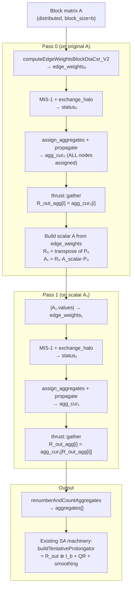

# MIS-k MPI-Parallel Implementation Plan

## Overview

Implement MPI-parallel MIS-k aggregation using PETSc's Galerkin coarsening approach:
```
R_out = I
for i = 0 to k-1:
    R = MIS-1(A)       // with exchange_halo for MPI correctness
    A = R * A * R^T     // Galerkin coarse-grid operator
    R_out = R * R_out   // compose restrictions (thrust::gather on integer array)
```

All work on the scalar nodal graph. Final output is `aggregates[]` (integer array).
The existing SA machinery in `buildTentativeProlongator()` handles the Kronecker
expansion `P_tent = R_out ⊗ I_b` + QR + smoothing — no changes needed there.

---

## Step 1: MIS-1 MPI Fix — Add `exchange_halo` to MIS-1 Loop

### Goal
Make `mis_k=1` fully MPI-correct by exchanging the `status_vec` (IVector) after
each MIS iteration. Currently, boundary nodes on different partitions can both
become MIS roots because halo nodes are skipped (`jcol >= num_rows`).

### Files to Modify
- `src/aggregation/selectors/mis_selector.cu` — ~10 lines in `setAggregates_common_sqblocks()`

### Changes

In the MIS iteration loop (lines 514-540 of `mis_selector.cu`), after each kernel
launch and before counting undecided nodes, add:

```cpp
// After find_mis_k1_kernel or find_mis_k2_kernel:
if (!A.is_matrix_singleGPU())
{
    // Resize status_vec to cover halo nodes if needed
    if (status_vec.size() < total_rows)
    {
        status_vec.resize(total_rows, MIS_UNDECIDED);
        status_ptr = status_vec.raw();
    }
    status_vec.dirtybit = 1;
    A.manager->exchange_halo(status_vec, status_vec.tag);
}
```

Also need to resize `node_weights` to `total_rows` and exchange it once before
the loop so that halo node weights are available for comparison:

```cpp
if (!A.is_matrix_singleGPU())
{
    node_weights.resize(total_rows);
    // Recompute weights for halo nodes (or exchange them)
    assign_node_weights_kernel<<<...>>>(total_rows, node_weights_ptr);
    // Actually, hash(node_id) is deterministic, so each rank computes the
    // same weight for the same global node. But local node IDs differ across
    // ranks, so we must exchange. Alternatively, use global IDs for hashing.
    // Simplest: exchange node_weights after computing for owned nodes.
    node_weights.dirtybit = 1;
    A.manager->exchange_halo(node_weights, node_weights.tag);
}
```

**Important**: The `find_mis_k1_kernel` currently uses `jcol >= num_rows` to skip
halo nodes. After exchanging status, halo nodes will have valid status values.
Change the skip condition to only skip self-loops (`jcol == tid`), and use
`total_rows` as the upper bound for valid columns. The kernel should NOT modify
halo nodes (only read their status), so keep the `tid < num_rows` (owned) guard
for writes.

### Verification (Single GPU)
- Build and run with `selector=MIS, mis_k=1` on a single GPU
- Compare aggregate count and convergence with the pre-fix version
- Single-GPU behavior should be identical (no halo exchange occurs)
- Run the existing aggregation tests: `aggregates_determinism_test`, `multi_pairwise_test`

### Verification Commands
```bash
# Build
cd build && cmake .. && make -j$(nproc)

# Run single-GPU test with MIS selector
./tests/amgx_tests_launcher --gtest_filter="*aggregates*"

# Run a Poisson solve with MIS
./examples/amgx_capi -m ../test_matrices/poisson7_100.mtx \
    -c ../src/configs/AGGREGATION_SA_MIS.json
```

---

## Step 2: Single-GPU MIS-k=2 via Galerkin Coarsening Loop

### Goal
Implement the full Galerkin coarsening loop for `mis_k=2` on single GPU.
Multi-GPU with `mis_k>1` falls back to `mis_k=1` with a warning.

### Files to Modify
- `src/aggregation/selectors/mis_selector.cu` — restructure `setAggregates_common_sqblocks()`
- `include/aggregation/selectors/mis_selector.h` — add helper method declarations

### Algorithm

Restructure `setAggregates_common_sqblocks()` to:

```cpp
void setAggregates_common_sqblocks(A, aggregates, aggregates_global, num_aggregates)
{
    int n_orig = A.get_num_rows();

    // Multi-GPU fallback for mis_k > 1 (until Step 4 is implemented)
    int effective_k = this->m_mis_k;
    if (!A.is_matrix_singleGPU() && effective_k > 1)
    {
        // TODO: Step 4 will add multi-GPU support for mis_k > 1
        // For now, fall back to mis_k=1 with a warning
        amgx_printf("WARNING: mis_k=%d not yet supported on multi-GPU, falling back to mis_k=1\n", effective_k);
        effective_k = 1;
    }

    // Initialize composed aggregation: R_out_agg[i] = i (identity)
    IVector R_out_agg(n_orig);
    thrust::sequence(R_out_agg.begin(), R_out_agg.end());

    // A_cur starts as the original matrix
    // For pass 0, we use A directly (block matrix)
    // For pass 1+, A_cur is the scalar Galerkin matrix
    const Matrix_d *A_cur_ptr = &A;
    Matrix_d A_coarse;  // storage for Galerkin coarse matrix

    for (int pass = 0; pass < effective_k; pass++)
    {
        const Matrix_d &A_cur = *A_cur_ptr;
        int n_cur = A_cur.get_num_rows();

        // --- Phase 1: Compute edge weights ---
        // Pass 0: use computeEdgeWeightsBlockDiaCsr_V2 on block matrix
        // Pass 1+: use |A_cur.values| directly (scalar matrix)
        FVector edge_weights_cur;
        if (pass == 0)
        {
            // existing edge weight computation (already in current code)
            edge_weights_cur.resize(A_cur.get_num_nz());
            computeEdgeWeightsBlockDiaCsr_V2<<<...>>>(...);
        }
        else
        {
            // Scalar matrix: edge weights = |values|
            edge_weights_cur.resize(A_cur.get_num_nz());
            thrust::transform(A_cur.values.begin(),
                              A_cur.values.begin() + A_cur.get_num_nz(),
                              edge_weights_cur.begin(),
                              [] __device__ (auto v) { return fabsf((float)v); });
        }

        // --- Phase 2: MIS-1 root selection ---
        // (existing code: assign_node_weights, find_mis_k1_kernel loop,
        //  with exchange_halo from Step 1)
        IVector status_cur(n_cur, MIS_UNDECIDED);
        FVector node_weights_cur(n_cur);
        assign_node_weights_kernel<<<...>>>(n_cur, node_weights_cur.raw());
        // ... MIS-1 iteration loop with exchange_halo ...

        // --- Phase 3: Assign ALL nodes to aggregates ---
        IVector agg_cur(n_cur, -1);
        assign_aggregates_kernel<<<...>>>(A_cur, edge_weights_cur, status_cur, agg_cur);
        // propagate to ensure no orphans
        propagate_aggregates_kernel<<<...>>>(agg_cur, ...);

        // --- Phase 4: Compose R_out_agg ---
        // Renumber agg_cur to 0..n_roots-1
        int n_roots;
        renumberAndCountAggregates(agg_cur, dummy_global, n_cur, n_roots);

        // R_out_agg[i] = agg_cur[R_out_agg[i]]
        IVector tmp(n_orig);
        thrust::gather(R_out_agg.begin(), R_out_agg.end(),
                       agg_cur.begin(), tmp.begin());
        R_out_agg.swap(tmp);

        // --- Phase 5: Galerkin product (skip on last pass) ---
        if (pass < effective_k - 1)
        {
            // Build R from agg_cur (pattern from agg_selector.cu:83-97)
            Matrix_d P_cur, R_cur;
            P_cur.addProps(CSR); P_cur.delProps(COO); P_cur.delProps(DIAG);
            P_cur.row_offsets.resize(n_cur + 1);
            P_cur.values.resize(n_cur, 1.0);
            P_cur.col_indices.resize(n_cur);
            thrust::sequence(P_cur.row_offsets.begin(), P_cur.row_offsets.end());
            thrust::copy(agg_cur.begin(), agg_cur.end(), P_cur.col_indices.begin());
            P_cur.resize(n_cur, n_roots, n_cur, 1, 1, false);
            P_cur.set_initialized(1);

            // R = P^T
            R_cur.set_initialized(0);
            transpose(P_cur, R_cur);

            // A_coarse = R * A_cur * P  (Galerkin product)
            A_coarse.set_initialized(0);
            CSR_Multiply<TConfig_d>::csr_galerkin_product(
                R_cur, A_cur, P_cur, A_coarse,
                nullptr, nullptr, nullptr, nullptr, nullptr, nullptr, nullptr);
            A_coarse.computeDiagonal();
            A_coarse.set_initialized(1);

            A_cur_ptr = &A_coarse;
        }
    }

    // --- Final: output aggregates ---
    aggregates.resize(total_rows);
    thrust::fill(aggregates.begin(), aggregates.end(), -1);
    thrust::copy(R_out_agg.begin(), R_out_agg.end(), aggregates.begin());

    this->renumberAndCountAggregates(aggregates, aggregates_global,
                                     n_orig, num_aggregates);
}
```

### Key Implementation Details

1. **Edge weights for pass 1+**: The Galerkin product `R·A·R^T` sums fine-grid
   values into coarse entries. Use `|A_coarse.values|` as edge weights for
   `assign_aggregates_kernel` on subsequent passes.

2. **Node weights**: Use `hash_val(node_id, seed + pass)` with a different seed
   per pass to avoid correlation between passes.

3. **`csr_galerkin_product` requires `block_size == 1`**: Pass 0 operates on the
   block matrix but only uses the graph topology + edge weights. The Galerkin
   product on pass 0 needs a scalar matrix. Solution: build a scalar `A_scalar`
   from the edge weights for the Galerkin product:
   ```cpp
   // A_scalar has same sparsity as A, values = edge_weights
   A_scalar.row_offsets = A.row_offsets
   A_scalar.col_indices = A.col_indices
   A_scalar.values = edge_weights
   A_scalar.resize(n, n, nnz, 1, 1)  // 1x1 blocks
   ```

4. **Multi-GPU fallback**: When `!A.is_matrix_singleGPU() && mis_k > 1`, print
   a warning and set `effective_k = 1`. Add a comment:
   ```cpp
   // TODO (Step 4): Multi-GPU MIS-k support
   // Use setNeighborAggregates() to set up Ac.manager from A.manager + agg_cur,
   // then computeAOperator() for the distributed Galerkin product,
   // then prepareNextLevelMatrix() to finalize halo rows.
   // These functions are in aggregation_amg_level.cu and handle all
   // distributed manager setup (B2L_maps, halo_offsets, renumbering).
   ```

### Verification (Single GPU)
```bash
# Compare MIS-1 vs MIS-2 aggregate counts
./examples/amgx_capi -m ../test_matrices/poisson7_100.mtx \
    -c ../src/configs/AGGREGATION_SA_MIS.json \
    -amgx "selector=MIS, mis_k=1"

./examples/amgx_capi -m ../test_matrices/poisson7_100.mtx \
    -c ../src/configs/AGGREGATION_SA_MIS.json \
    -amgx "selector=MIS, mis_k=2"

# Expected: MIS-2 produces ~4x fewer aggregates than MIS-1
# Expected: MIS-2 convergence rate should be similar or slightly worse
#           (fewer aggregates = more aggressive coarsening)
```

---

## Step 3: Verify MIS-1 MPI Fix on Multi-GPU

### Goal
Verify that Step 1's `exchange_halo` fix produces correct MIS-1 aggregation
on multiple GPUs. The aggregate boundaries should be consistent across partitions.

### Prerequisites
- Step 1 completed and verified on single GPU
- Multi-GPU test environment (2+ GPUs or MPI ranks)

### Verification
```bash
# 2-GPU test with MIS-1
mpirun -np 2 ./examples/amgx_capi \
    -m ../test_matrices/poisson7_100.mtx \
    -c ../src/configs/AGGREGATION_SA_MIS.json \
    -amgx "selector=MIS, mis_k=1"

# Compare convergence rate with single-GPU run
# Expected: similar iteration count and convergence rate
# Expected: no MIS roots adjacent across partition boundaries
```

### What to Check
1. **Convergence**: iteration count should be similar to single-GPU
2. **Aggregate quality**: no adjacent MIS roots at partition boundaries
3. **Determinism**: same result regardless of partition count (for same global ordering)
4. **No crashes**: `exchange_halo` on `IVector` status_vec works correctly

### Potential Issues
- `node_weights` must be consistent across partitions. Since `hash_val(local_id)`
  uses local IDs, different partitions assign different weights to the same global
  node. Fix: use global node IDs for hashing, or exchange node_weights.
- `status_vec` must be resized to `total_rows` (owned + halo) before exchange.

---

## Step 4: Multi-GPU MIS-k=2 via Distributed Galerkin Coarsening

### Goal
Remove the multi-GPU fallback from Step 2 and implement the full distributed
Galerkin coarsening loop for `mis_k > 1`.

### Approach: Reuse Existing Distributed Infrastructure

The existing aggregation AMG level already has a complete distributed "PtAP"
pipeline that runs for every AMG level:

```
setNeighborAggregates()     — sets up Ac.manager from A.manager + aggregates
computeRestrictionOperator() — builds R_row_offsets, R_column_indices
computeAOperator()          — Ac = R·A·R^T (CoarseAGenerator)
prepareNextLevelMatrix()    — exchanges halo rows, finalizes Ac
```

Key functions and their locations:
- `setNeighborAggregates()` — `aggregation_amg_level.cu:1751`
  Sets up `Ac.manager` with `B2L_maps`, `halo_offsets`, `neighbors`, `createRenumbering`
- `computeAOperator()` — `coarse_A_generator.h:29` (standalone virtual function)
  Interface: `computeAOperator(A, Ac, aggregates, R_row_offsets, R_col_indices, num_aggs)`
- `prepareNextLevelMatrix()` — `aggregation_amg_level.cu:1585`
  Exchanges halo rows, renumbers columns, appends halo data to Ac

### Implementation Options

**Option A (Recommended): Extract utility functions**

Refactor `setNeighborAggregates` and `prepareNextLevelMatrix` into standalone
utility functions that take `(A, Ac, aggregates, num_aggregates)` without
requiring an `Aggregation_AMG_Level` object. This is ~200 lines of refactoring
but produces clean, reusable code.

**Option B: Inline the logic**

Copy the ~80 lines of `setNeighborAggregates` logic (B2L_maps setup,
createRenumbering, halo aggregate exchange) directly into the MIS selector.
Faster to implement but duplicates code.

**Option C: Create temporary AMG level**

Create a temporary `Aggregation_AMG_Level` object, set its member variables,
and call its methods. Awkward but avoids code duplication.

### Files to Modify
- `src/aggregation/selectors/mis_selector.cu` — remove multi-GPU fallback, add distributed loop
- `src/aggregation/aggregation_amg_level.cu` — (Option A) extract utility functions
- `include/aggregation/aggregation_amg_level.h` — (Option A) declare utility functions

### Changes to the Galerkin Loop (replacing the fallback)

```cpp
// Remove the fallback:
// if (!A.is_matrix_singleGPU() && effective_k > 1) { effective_k = 1; }

// In the Galerkin product section (Phase 5), replace single-GPU code with:
if (pass < effective_k - 1)
{
    if (A_cur.is_matrix_singleGPU())
    {
        // Single-GPU path (from Step 2)
        // ... build P, R, csr_galerkin_product ...
    }
    else
    {
        // Multi-GPU path: use existing distributed infrastructure
        Matrix_d A_next;
        A_next.manager = new DistributedManager<TConfig_d>();

        // 1. Set up Ac.manager from A_cur.manager + agg_cur
        //    (logic from setNeighborAggregates, ~80 lines)
        setup_coarse_distributed_manager(A_cur, A_next, agg_cur, n_roots);

        // 2. Build R_row_offsets, R_column_indices from agg_cur
        //    (logic from computeRestrictionOperator, ~30 lines)
        IVector R_row_offsets, R_column_indices;
        build_restriction_operator(agg_cur, n_cur, n_roots,
                                   R_row_offsets, R_column_indices);

        // 3. Compute Ac = R * A_cur * R^T
        //    (standalone call to CoarseAGenerator)
        CoarseAGenerator<TConfig_d> *cag =
            CoarseAGeneratorFactory<TConfig_d>::allocate(cfg, cfg_scope);
        cag->computeAOperator(A_cur, A_next, agg_cur,
                              R_row_offsets, R_column_indices, n_roots);
        delete cag;

        // 4. Exchange halo rows and finalize
        //    (logic from prepareNextLevelMatrix, ~200 lines)
        finalize_coarse_matrix(A_cur, A_next);

        A_coarse.swap(A_next);
        A_cur_ptr = &A_coarse;
    }
}
```

### Verification (Multi-GPU)
```bash
# 2-GPU test with MIS-2
mpirun -np 2 ./examples/amgx_capi \
    -m ../test_matrices/poisson7_100.mtx \
    -c ../src/configs/AGGREGATION_SA_MIS.json \
    -amgx "selector=MIS, mis_k=2"

# Compare with single-GPU MIS-2
./examples/amgx_capi -m ../test_matrices/poisson7_100.mtx \
    -c ../src/configs/AGGREGATION_SA_MIS.json \
    -amgx "selector=MIS, mis_k=2"

# Expected: similar aggregate count and convergence rate
# Expected: ~4x fewer aggregates than MIS-1 on same problem
```

### What to Check
1. **Aggregate count**: multi-GPU MIS-2 should produce similar count to single-GPU MIS-2
2. **Convergence**: iteration count should be comparable
3. **Scaling**: test on 1, 2, 4 GPUs — aggregate quality should not degrade
4. **Correctness**: the composed `R_out_agg` must map every fine node to exactly one coarse aggregate

---

## Architecture Diagram



## Summary

| Step | Scope | Key Change | Verification | Mode | Status |
|------|-------|------------|--------------|------|--------|
| 1 | MIS-1 MPI fix | Add `exchange_halo(status_vec)` after each MIS iteration | Single GPU: identical behavior | code | Not started |
| 2 | Single-GPU MIS-2 | Galerkin loop with `csr_galerkin_product` | Single GPU: ~4x fewer aggregates | code | Not started |
| 3 | Verify Step 1 multi-GPU | No code changes | Multi-GPU: consistent aggregates at boundaries | debug | Not started |
| 4 | Multi-GPU MIS-2 | Use `setNeighborAggregates` + `computeAOperator` + `prepareNextLevelMatrix` | Multi-GPU: same quality as single-GPU | code | Not started |
