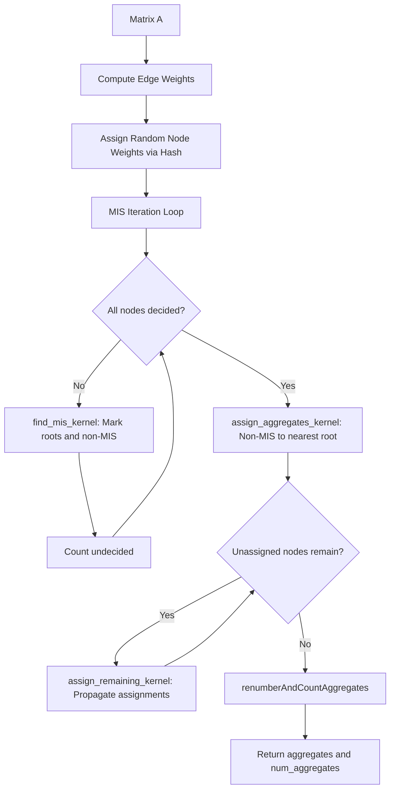

# MIS-k Aggregation Selector — Implementation Plan

## Goal

Implement a GPU-parallel MIS-k (Maximal Independent Set, distance k) aggregation selector for AMGX to match PETSc GAMG's aggregation quality and achieve h-independent convergence rates for SA-AMG.

## Background

PETSc GAMG uses MIS-based aggregation (see `petsc/src/mat/graphops/coarsen/impls/misk/misk.c`). The algorithm:

1. Assigns random weights to each node
2. Finds a Maximal Independent Set: a node is in the MIS if it has the highest weight among all neighbors within distance k
3. Each MIS node becomes an aggregate root
4. Non-MIS nodes are assigned to the nearest root's aggregate

This produces roughly spherical aggregates with bounded diameter, which is critical for SA-AMG convergence quality. The current MULTI_PAIRWISE selector produces elongated chain-like aggregates that degrade convergence as the mesh is refined.

## Algorithm: MIS-k Aggregation

### Phase 1: Compute MIS-k

For distance k=1 (standard MIS):
```
for each node i in parallel:
    weight[i] = hash(i)   // deterministic random weight
    
repeat until all nodes are decided:
    for each undecided node i in parallel:
        is_max = true
        for each neighbor j of i:
            if weight[j] > weight[i]:
                is_max = false
            if j is already in MIS and dist(i,j) <= k:
                mark i as NOT in MIS
        if is_max:
            mark i as IN MIS (aggregate root)
        if any neighbor is in MIS:
            mark i as NOT in MIS
```

For distance k=2 (aggressive coarsening):
- Either use the squared graph A^T*A (PETSc's `-pc_gamg_aggressive_square_graph`)
- Or use MIS on the original graph but check distance-2 neighbors

### Phase 2: Assign Non-MIS Nodes to Aggregates

```
for each non-MIS node i in parallel:
    find the nearest MIS root among neighbors
    aggregates[i] = nearest_root
    
// Handle remaining unassigned nodes (distance > 1 from any root)
repeat until all assigned:
    for each unassigned node i:
        find any assigned neighbor j
        aggregates[i] = aggregates[j]
```

### Phase 3: Renumber Aggregates

Use the existing `renumberAndCountAggregates()` from the `Selector` base class.

## Files to Create/Modify

### New Files

1. **`include/aggregation/selectors/mis_selector.h`** — Header for MIS selector
2. **`src/aggregation/selectors/mis_selector.cu`** — GPU implementation

### Files to Modify

3. **`src/core.cu`** — Register the new selector factory
4. **`src/configs/AGGREGATION_SA_CHEBY.json`** — Add MIS variant config
5. **`CLAUDE.md`** — Document the new selector

## Detailed Design

### Header: `include/aggregation/selectors/mis_selector.h`

```
namespace amgx::aggregation::mis_selector

class MISSelectorBase : public Selector<T_Config>
    // Config parameters
    int m_mis_k;              // MIS distance (1=standard, 2=aggressive)
    int m_max_iterations;     // Max iterations for MIS convergence
    int m_merge_singletons;   // How to handle isolated nodes
    
    // Interface
    void setAggregates(Matrix &A, IVector &aggregates, 
                       IVector &aggregates_global, int &num_aggregates)

class MISSelector<host> : public MISSelectorBase<host>
class MISSelector<device> : public MISSelectorBase<device>
class MISSelectorFactory : public SelectorFactory<T_Config>
```

### Implementation: `src/aggregation/selectors/mis_selector.cu`

#### Key CUDA Kernels

1. **`assign_random_weights_kernel`**
   - Input: num_rows
   - Output: weight[num_rows] — deterministic hash-based weights
   - Uses `hash_val()` from `common_selector.h`

2. **`find_mis_kernel`** (for k=1)
   - Input: A.row_offsets, A.col_indices, weight[], status[]
   - Output: status[] updated — MIS_ROOT / NOT_IN_MIS / UNDECIDED
   - Each undecided node checks if it has max weight among undecided neighbors
   - If yes → MIS_ROOT
   - If any neighbor is MIS_ROOT → NOT_IN_MIS

3. **`find_mis_k2_kernel`** (for k=2)
   - Same as above but checks distance-2 neighbors
   - For each neighbor j of i, also check neighbors of j
   - More expensive but produces larger aggregates

4. **`assign_aggregates_kernel`**
   - Input: A.row_offsets, A.col_indices, status[], edge_weights[]
   - Output: aggregates[]
   - Each non-root node finds the strongest-connected MIS root neighbor
   - Sets aggregates[i] = root_id

5. **`assign_remaining_kernel`**
   - Handles nodes not directly adjacent to any MIS root
   - Iteratively assigns to nearest assigned neighbor's aggregate
   - Runs until all nodes are assigned

#### Main Flow: `setAggregates()`

```
1. Compute edge weights (reuse computeEdgeWeightsBlockDiaCsr_V2 from common_selector.h)
2. Assign random weights via hash function
3. Iteratively find MIS:
   - Launch find_mis_kernel
   - Count undecided nodes
   - Repeat until all decided (typically 5-15 iterations)
4. Assign non-MIS nodes to nearest root aggregate
5. Handle remaining unassigned nodes
6. Call renumberAndCountAggregates()
```

### Registration in `src/core.cu`

Add at line ~648:
```cpp
aggregation::SelectorFactory<T_Config>::registerFactory("MIS", 
    new aggregation::mis_selector::MISSelectorFactory<T_Config>);
```

Add config parameter registration at line ~475:
```cpp
AMG_Config::registerParameter<int>("mis_k", 
    "for selector=MIS: distance parameter k (1=standard, 2=aggressive) <1>", 1);
```

Update the selector parameter allowed values at line ~465 to include `MIS`.

### Config: `src/configs/AGGREGATION_SA_MIS.json`

```json
{
    "config_version": 2,
    "solver": {
        "print_grid_stats": 1,
        "algorithm": "AGGREGATION",
        "solver": "AMG",
        "smoother": {
            "solver": "CHEBYSHEV",
            "preconditioner": {
                "solver": "BLOCK_JACOBI",
                "max_iters": 1
            },
            "chebyshev_polynomial_order": 2,
            "chebyshev_lambda_estimate_mode": 4,
            "chebyshev_lmin_denom": 10.0,
            "scope": "cheby"
        },
        "presweeps": 1,
        "selector": "MIS",
        "mis_k": 1,
        "convergence": "RELATIVE_INI",
        "coarse_solver": "DENSE_LU_SOLVER",
        "max_iters": 100,
        "monitor_residual": 1,
        "min_coarse_rows": 10,
        "max_levels": 20,
        "postsweeps": 1,
        "tolerance": 1e-05,
        "norm": "L2",
        "cycle": "V"
    }
}
```

## Implementation Strategy

### Step-by-step approach

The MIS algorithm is conceptually simpler than MULTI_PAIRWISE. The key challenge is GPU parallelism — the MIS computation is inherently iterative (each round resolves some nodes), but each round is embarrassingly parallel.

### Modeling after existing selectors

The implementation should follow the pattern of `size2_selector.cu`:
- Include `common_selector.h` for shared kernels
- Use the same edge weight computation
- Follow the same `setAggregates()` → `setAggregates_common_sqblocks()` pattern
- Use `renumberAndCountAggregates()` from the base class

### Key differences from MULTI_PAIRWISE

| Aspect | MULTI_PAIRWISE | MIS |
|--------|---------------|-----|
| Core algorithm | Pairwise matching, multiple passes | MIS computation, single pass |
| Aggregate shape | Chain-like, elongated | Roughly spherical |
| Coarsening ratio | ~2^passes per pass | ~4-8x for k=1, ~16-64x for k=2 |
| Parallelism | Good — matching is parallel | Good — MIS rounds are parallel |
| Determinism | Hash-based tie-breaking | Hash-based weights |
| Complexity | O(passes * iterations * nnz) | O(iterations * nnz) |

## Testing Plan

1. **Unit test**: Verify MIS property — no two roots are within distance k
2. **Aggregate quality**: Log aggregate sizes, check distribution
3. **Convergence test**: Run 200x200 and 400x400 Poisson with MIS selector
4. **Comparison**: Match iteration counts against PETSc GAMG
5. **Scaling test**: Run 800x800 to verify h-independent convergence

## Expected Results

Based on PETSc GAMG results:
- 200x200: ~14 iterations (vs current 23 with MULTI_PAIRWISE)
- 400x400: ~16 iterations (vs current 57 with MULTI_PAIRWISE)
- Convergence rate: ~0.49 (h-independent)
- Grid complexity: ~1.17
- Operator complexity: ~1.43

## Architecture Diagram



## Selector Interface Compliance

The new selector must implement the pure virtual method from [`Selector<T_Config>`](include/aggregation/selectors/agg_selector.h:30):

```cpp
virtual void setAggregates(Matrix<T_Config> &A,
                           IVector &aggregates, 
                           IVector &aggregates_global, 
                           int &num_aggregates) = 0;
```

**Contract**:
- `aggregates`: output array of size `A.get_num_rows()`, each entry is the aggregate ID for that node
- `aggregates_global`: for distributed matrices, the global aggregate IDs
- `num_aggregates`: output, total number of aggregates created
- Aggregate IDs must be contiguous 0..num_aggregates-1 (handled by `renumberAndCountAggregates()`)
